# What is AI
### Demytifing AI
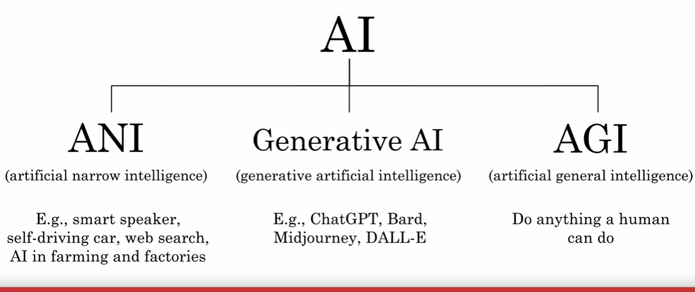

## What is Machine learning
### Superwised learning
#### Mapping of a input to output is call a superwise learning

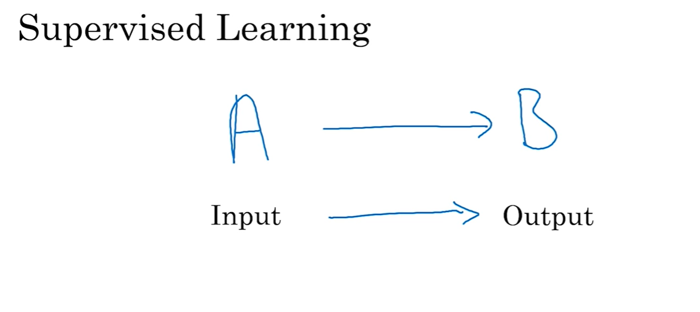

#### Some examples for superwised learning

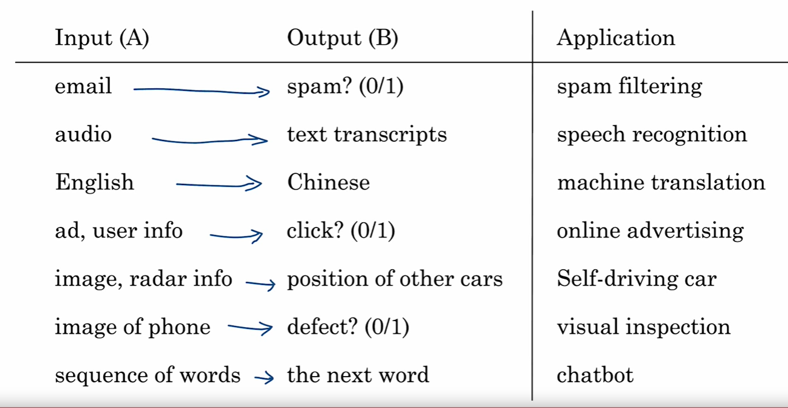

### How large language models (LLM) works
#### LLMs are build by superwised learning (A -> B) to predict the next words

- Example

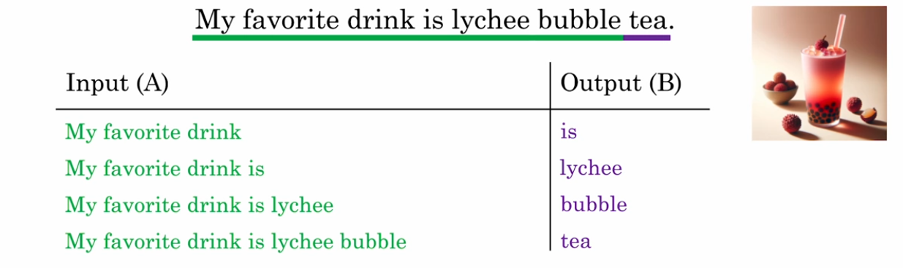

- When we train a very large AI system on a lost of data (hundreds of billions of words), we get a Large Language Model like ChatGPT.

#### Performce vs amount of data

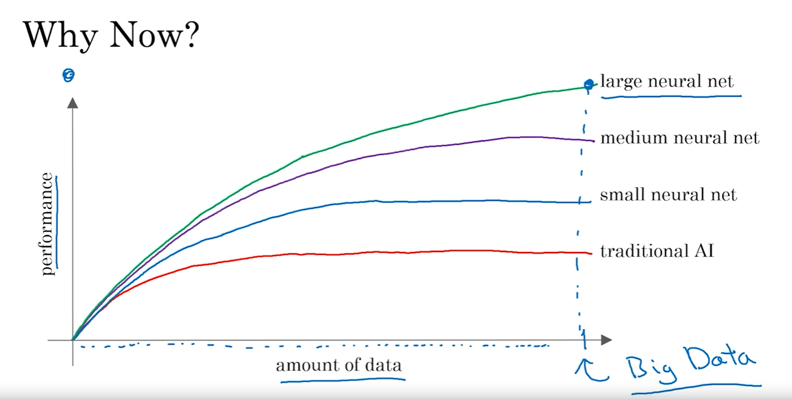
- Performce gets better if we train a neural nextwork with very large data

## What is data?
### Example of a table of data (Dataset)
#### Example of house dataset

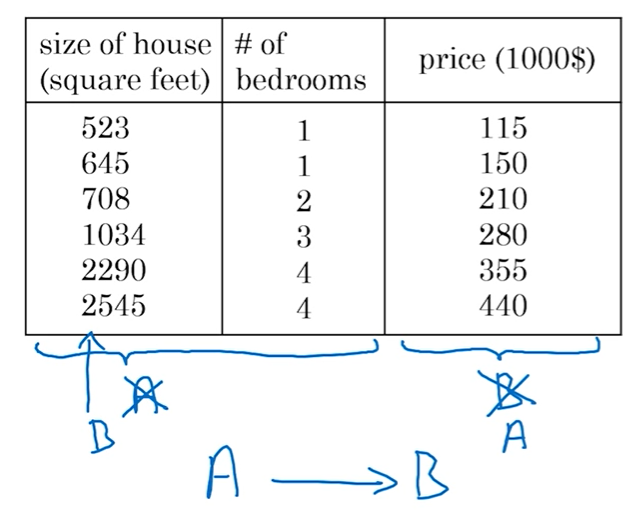

- Data describe size of the house and # of badrooms can be bought using a certain price or visa versa.
- If A is 'size of the house and # of badrooms', we this training data we can find the price of the house 'B' or visa versa.

#### Example of the cat Image labeling

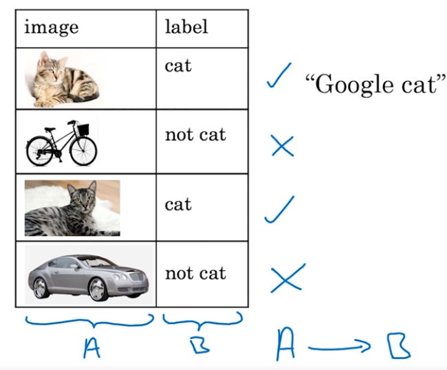

- 'image' is a input here and 'label' is a output.

### Acquiring Data
#### Manual labeling 

- Traditional way to label data manually to prepare data for AI model.

#### From Observing Behaviors
##### Get purchase data to know user behaviors

- Collect data from user purchases behaviors.

##### Get data from large machine factory

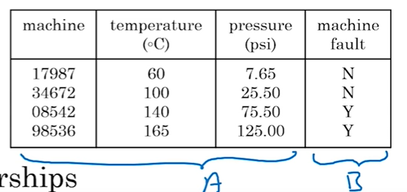

- Collect data from factory where large machines are runing.
- Data shows at what parameter, machine could be in fault.
- This data helps to reduce maintenance/cost of repairing of the machine.

##### Download from websites/partnerships
- Speach recognization dataset
- Image dataset
- self driving dataset
- Medical engineering dataset

### Use or mis-use of data
#### Collecting data without AI team and with only IT team.
- Data could me irrelavent for AI modeling
- If we have AI and IT team togather, AI team may provide a feedback to IT team for data collection changes for better efficiency.
- Example: Data getting collected from big machine factory in every 15 mins. For better data, AI team may ask for collecting data in every 5 mins.

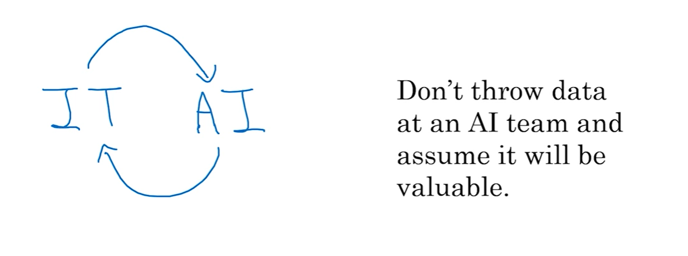

### Data is Messy
- Garbage in, Garbage out
    - if we provide incorrect data to AI, it will learn to provide wrong/unexpected output.

- Data problems
    - Incorrect labels
    - Missing values

    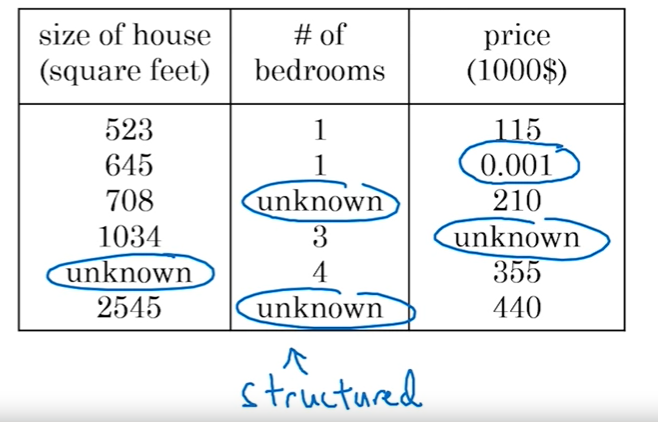

    - This data having multiple missing values and incorrect data.
    - AI team have to find a way to fill those missing values and correct, incorrect data.

- Multiple types of data (Unstructured Data)
    - Example
        - Image
        - Audio
        - Text
    - Most of the time we get data in unstructred format

- With Structured or unstructured data, supervised learning can be applied.

## The Terminology of AI
### Machine learning vs Data science
- Machine learning
    - Mapping Input A to output B
    - Running AI system (websites/mobile app)
    - Examples
        - On a websites, how many people cicking on the ad and based on interest showing ads to the user.
- Data science
    - To get insights of data
    - Examples
        - Homes are 3 bedrooms are more expensive than homes of 3 bedrooms of similer size
        - Newly renovated homes are have 15% more premium.
        - Extracting insights, that traval agencies are not consuming more advertisement and convince them to have more ads.

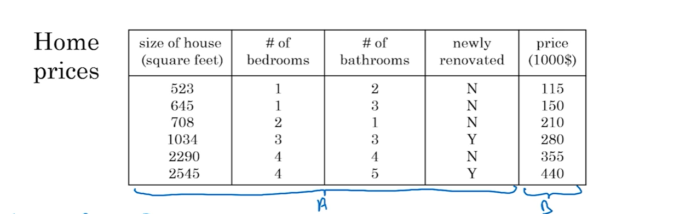

### Deep learning

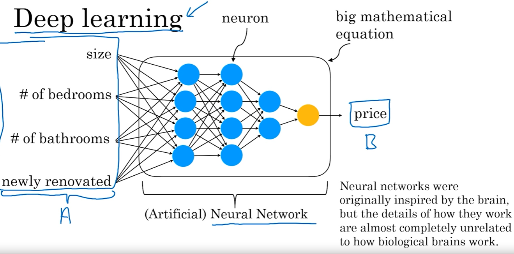

- Above picture represents the deep learning example
- 'A' is a input to (artificial) neural network and 'B' price is a output.
- Neural network is nothing but a big mathematical equation.
- This was originally inspired by brain but neural networks are completed unrelated how biological brain works.

#### Other buzz words for AI
- Generative AI
- unsupervised learning
- reinforcement learning
- graphical model
- planning 
- Knowlage graph

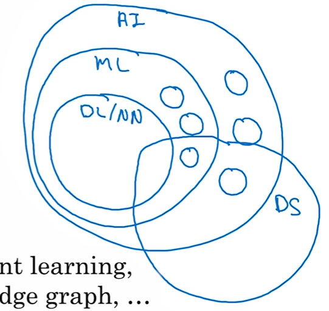

- AI: Artificial intellizence
- ML: Machine learning
- DL: Deep learning
- NN: Neural network
- DS: Data science
- Circles** : Other technologies

## What makes an AI company
### Lesson learn from the rise of the internet
- Internet Era
    - Shopping mall + website != Internet company
    - What make a company a Internet company
        - A/B testing - setting up to different websites and which one work well. This is difficult for setting up 2 shopping malls.
        - Short iteration time - ship a product eveny week/day but this is difficult for a shopping mall.
        - Decission pushed down to engineers and to specialized roles for a web sites building, on other head in shopping mall CEO only the making any decision.
- AI Era
    - Any compnay + deep learning != AI company
        - Strategic data acquisition: Build a product to not have any profit but to collect data.
        - Unified Data warehouses: Connect dots of the data spreaded around the multiple warehouses.
        - Parvasive automation: create a supervised learning models to connect dots of data automatically
        - New roles (MLE) and division of labor

### AI Transformation
1. Execute pilot project to gain momentum.
2. Build an in-house AI team.
3. Provide board AI training.
4. Develop an AI strategy.
5. Develop Internal and External communication.

## What Machine learning can do and cannot do
- Can do:
    - find position of other cars
    - Phone having scrach
    - audio to transcript
- cannot do:
    - accurately predict stock market future price using historical data.

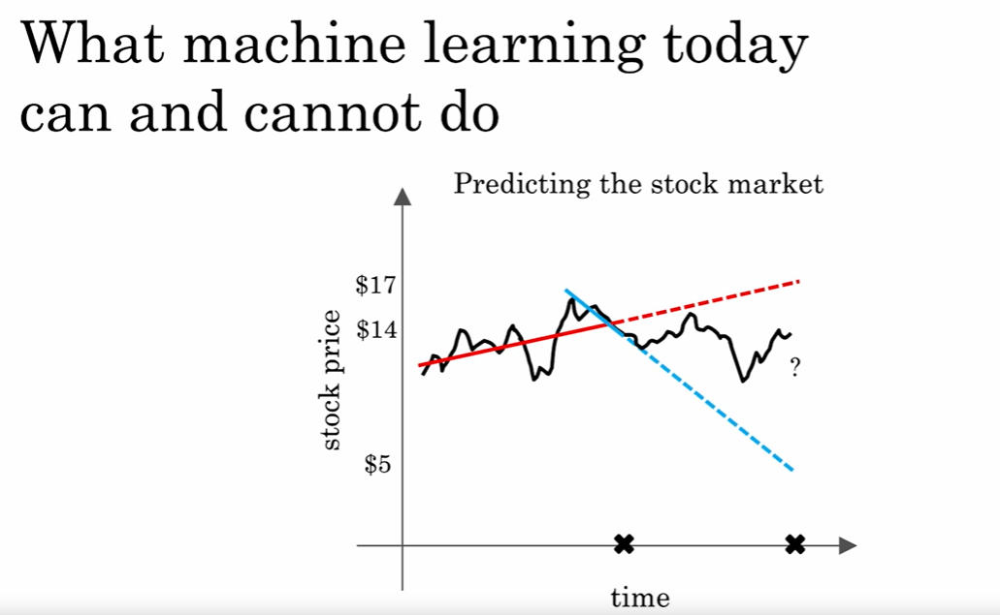

- Red line and blue light having different results which depends on historical data provided.
- But combining company sales data (if legally obtained), there are chances to predict future store prices.

### What makes an ML problem easier
1. Learning  a "simple" concept.
- Problems which required less than 1 sec to find a solution.
- Ex
    - 1 < sec: Find spot another car by looking from a window the car.
    - 1 > sec: Predict different companies sales.

2. A lots of data available
- If 'A' is a input and 'B' is a output.
- Find a phone have scratches or not.
- 'A' will a set of images and 'B' will be a output have phone having scratches or not.
- If we have lots of phone images, accuracy to find scratches on phone will be much higher.

## More examples of what machine learnng can or cannot do
### Self driving cars
- Can do:

    
    - Take pictures for vehicles using cars camera.
    - Process the image to know what is there in image.
    - Cars may use radar and lidar to know position of the car.

- Cannot do:

    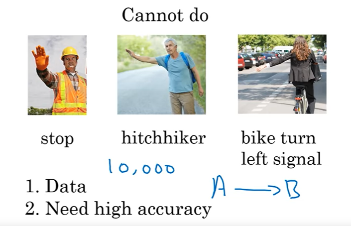
    - There are many ways people can make a gesture.
    - To have such kind of gesture recogization required 10K or more then that images/videos.
    - Accuracy is always a concern as recogizing such gestures are critical.
    - Sometime even people make mistakes to recogize a gesture.

### X-Ray diagnosis

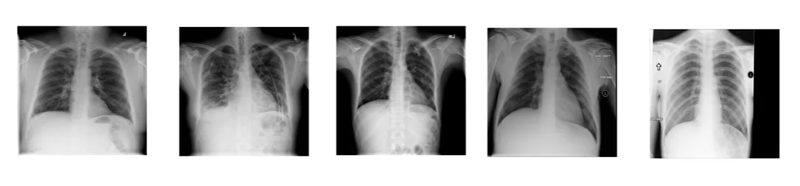

- Can do:
    - AI can diagnose pneumonia using ~10k images.

- Cannot do:
    - AI cannot diagnose pneumonia using 10 images and reading medical text books
    - The same task can be performed by a doctor.

- Diagnose become more defficult or impossible when we have rotated images or scratches in it.

    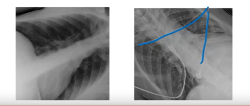

## Non-technical explanation of deep learning with example
- demystifying the facts of deep learning
### Demand Predication
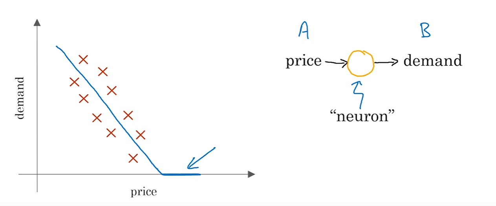

- Above graph shows demand predication based on price of a t-shirt.
- This is a simplest neural network which having only one neuron.
- Demand and price cannot go below zero.

#### with more parameters
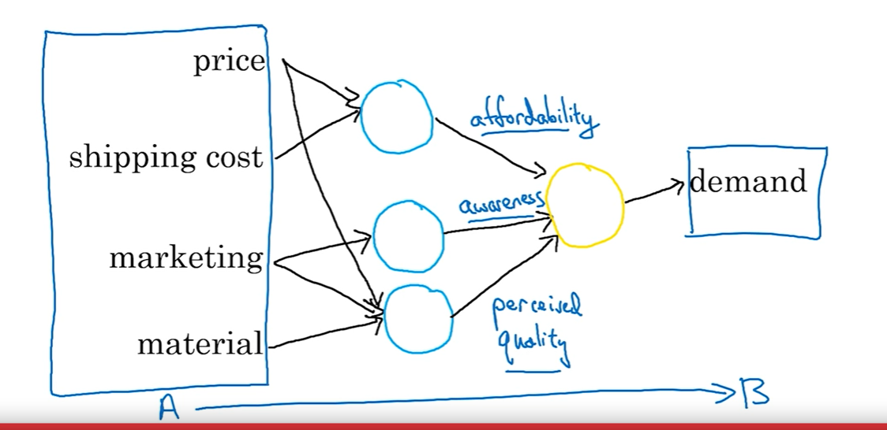

- Price and shipping cost can derive affordability
- Marketing can provide a awarness of the product.
- Price, marketing and material Perceised quality.
- Those 3 helps to derive demand of the t-shirt.

#### Auto train neural nextwork
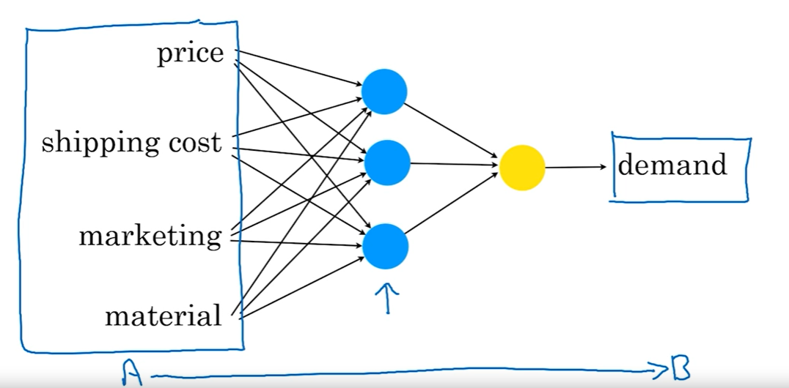

- If we have 'A' and 'B' as input and output and we have large data which having input and output, than it is a software job to train neurons (blue circles) to have auto configuration.
- This process required a large input data to be able to perform the job using neural network.

## Non-technical explanation of deep learning with example (part 2)
### Face recognization

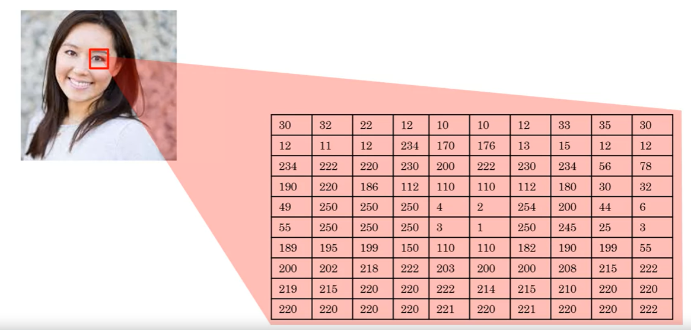

- An image gets store as a grid which contains brightness of a pixel.
- If it is color image, image will have 3 values per pixel, (red, green, blue) brightness.

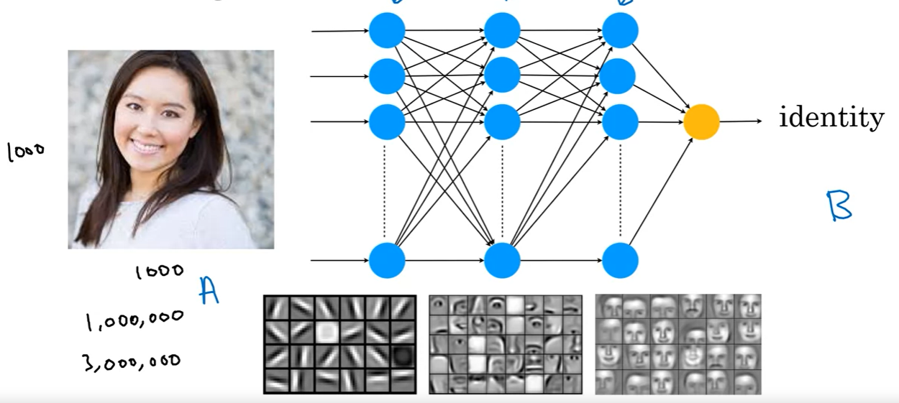

- If a image have 1000*1000 pixels than,
    - in case of gray scale image, it will have 1M pixels.
    - in case of color image, it will have 3M pixels.

- All pixel values have to passed to the neural network as input with output identity.
- Using provided data, neural network will get train to find the identity of a person.

