# Building AI projects
## Introduction
### Starting a AI projects
- Workflow of projects
    - Sequance of steps to be followed 
    - Example of birthday party
        - selecting a venue
        - Inviting guests
        - Ordering a cake
        - Ordering food
        - So on...

- Seleting an AI project (wast verity of projects can be selected)
    - Seleting by your self if having knowlage
    - Contact friends on other company to select a project

- Organizing data and team for projects

## Workflow of machine learning project
### Key steps for machine learning projects
#### Echo/Alexa

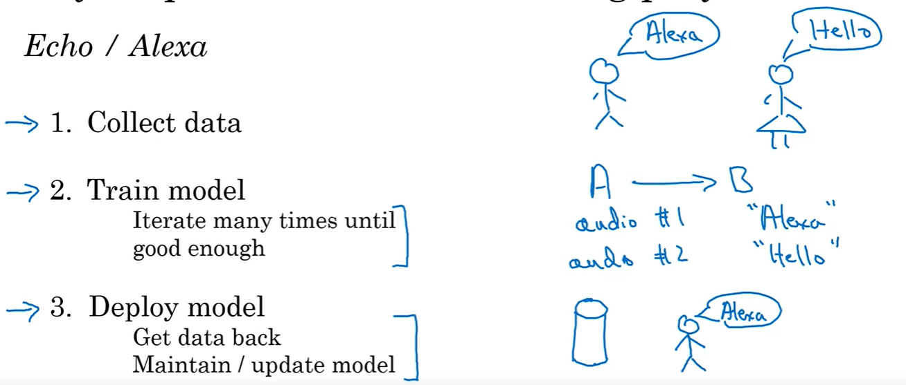

1. Collect Data
    - Collect data from muliple people
    - Collect different words/same words pronouncing by different people
2. Train Model
    1. Iterate multiple times until good enough
        - Provide audio #1 (Input #1) to learn word "Alexa" (output 'B')
        - Provide audio #2 (Input #2) to learn word "Hello" (output 'B')
3. Deploy Model
    1. Get data back
        - Audio data could be collected from one region and deployment of device done on another region.
        - Amazon echo may not be able to recognize voice due different accent in different region
        - Retrain model which region data required in this case.
    2. Maintain/update model
        - Provide more relavent data in case model is not good enough after deployment.

#### Self driving cars

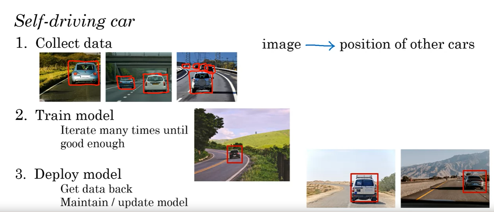

1. Collect data
    - Click images and get position of other cars
2. Train Model
    - Initially the model may detect wrong objects
    - With more data, the accurecy will increase and it will be able to detect right objcts
    - Some unpredictable objects also may come in the picture (like golf cart), which in turns we have to update the model.
3. Deploy model
    - Deploy model after tarining the model and maintain it.

## Workflow of a data science project
- Data science projects having slightly different approch then AI.

### Optimizing a sales funnel

- Selling mugs websites usally have 4 steps
    - selecting a mug
    - Check price and other things and add to cart
    - Go to cart and check payment
    - Checkout

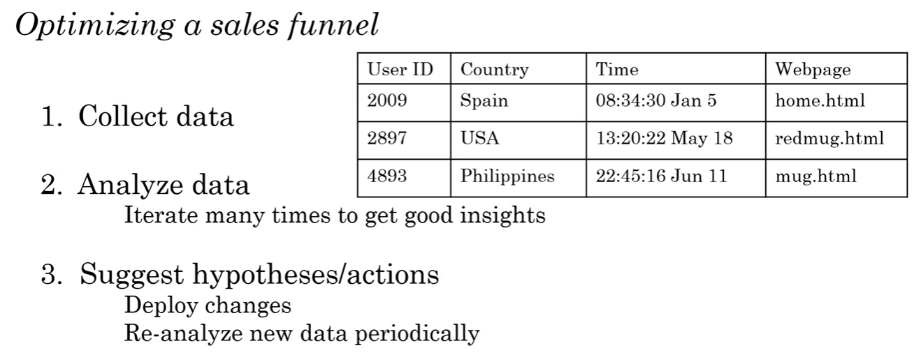

1. Collect data
    - Collect data of purchese from different users and from different countries.
    - This data may have country, time and webpage/website information.
2. Analyze data
    - Check and analize data multiple times to have insights.
    - Insights may derives when sale is higher/lower, time of higher or lower sale.
    - Sales could differ during different fastival period (higher/lower)
3. Suggest hypotheses/actions
    - Based on insights, hypotheses/actions can be derived which could help to optimize the sales strategy, showing number of ads (save cost of showing ads) and save cost in running redundent servers.

### Mug manufacturing line

1. Collect data from different mug manufacturing line stages.
2. Analyze data
    - Know if what temprature is best suitable at what time (different temp at morning/afternoon/evening)
    - Same for humidity
3. Suggest hypotheses / actions
    - May use different temp/humidity at different time to avoid cracks and better quality.
    - Re-analyze new data collected to have better action plan

## Every job function needs to learn how to use data
- Now a days people prefer to use digital notes, insteed of notes on papers.
- Like, to have a survey or to have doctor's prescription
- This data can be used to optimize the operation and can reduce the manual tasks

### Sales (lead sorting/prioritizing)

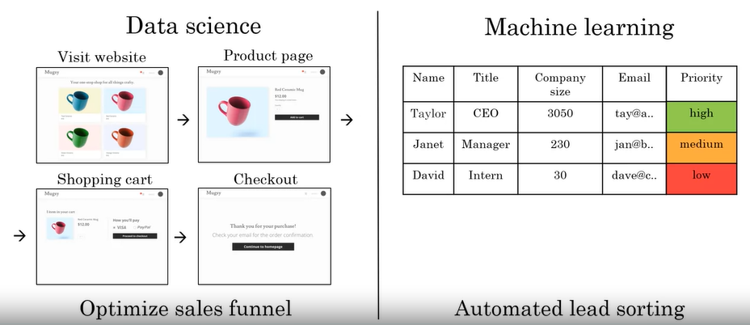

- Here Data science can optimize the sales funnel to optimize cost and sales.
- With collected data for lead from sales team or automatically, Machine learning can be to sort thpse lead

### Manufacturing line manager

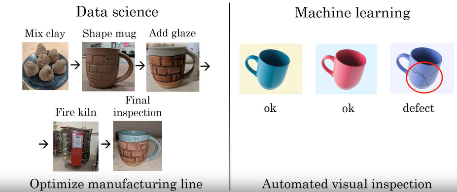
- A manufacturing company may have thousands of workers for creating product or for quality check
- Machine learning can be used, to have automated quality check after manufacturing.

### Recruiting

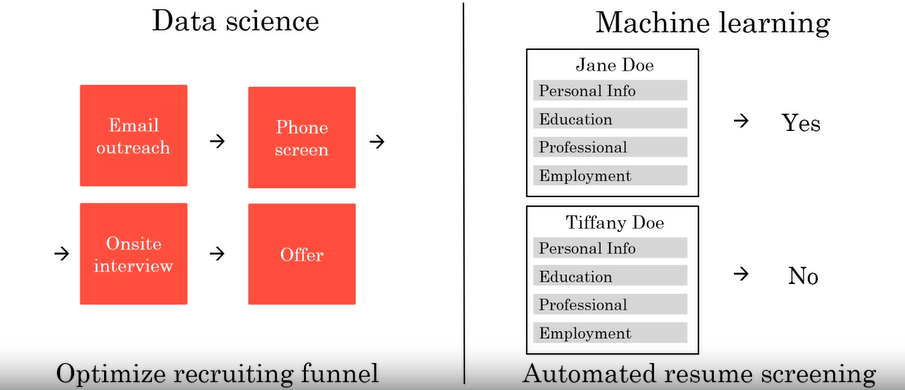

- Data science can help here to know how may candidates crosses which stage.
    - We may have so many candidates at 'Phone screening' stage than 'Onsite interview' stage.
- Machine learning can help to go through all the resume and provide output if a candidate resume is matching with job profile to have a phone call.
- <b>NOTE: there could be a ethical question on it, if the machine learning process is well capable enough to have resume sorted. (fairness or biased)</b>

### Marketing

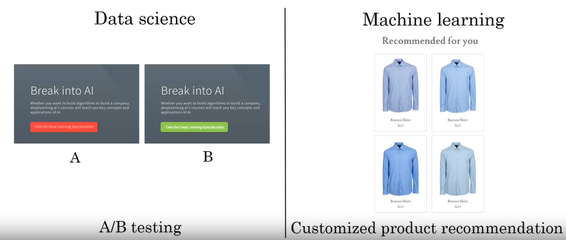

- Suppose we have 2 versions of a websites, data science can help to find which website people may finding more instresting and suitable to go through.
- On other hand, machine learning can provide a recommondation to user based on previous purchases. (it may recommand only blue color shirt).
    - Now a days, recommandations leading to have a high sale to products from a web site.

### Agriculture

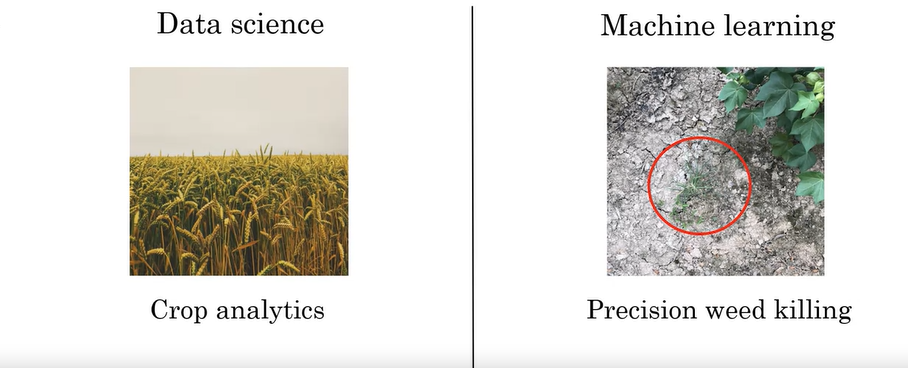

- Data science can provide information that when to plant, what to plant using soil data, weather condition, price in market and so on, to have more profit.
- On other hand, machine learning can provide a difference between a desired plant amd un expected plant to remove it / kill it. (example. weed)

## How to choose an AI project (Part 1)

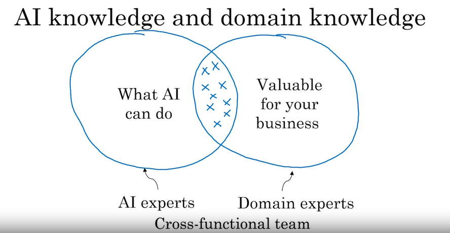

- To find a suitable project, a cross section between 'what ai can do' and 'valuable for business' can help to deside.
- There could be a discussion in between AI export and domain exports to find the cross saction area.
- Later on, a Cross functional team can be formed to with knowlag on both ai and domain area.

### Braiinstroming frameworks
- Think automatic tasks rather than jobs.
    - In call center, a predefined steps to be followed for tasks can be automated.
    - For radiology, radiologist may consult to doctor, train other trainee or taking an x-ray, etc. Some tasks can be automated to be done by machine learning.
- Sometimes when meeting with CEO, question can be asked, what ware the main drivers fo business value to have AI?
- Or Finding the mai pain points of business and automate them.

### You can progress even without big data
- Having more data also a good idea and never hurts.
- Having more data can make business defensible (like web search). More data can dereive accurate results.
- But in case we have a small data, we can still make progress.
- Example of coffee mug manufacturing:
    - Sometimes it is very hard to get many images of defective coffee mugs as it could be costly to have them for a manufacturing company.
    - But 10/100/1000 image of defective mugs a good to make some progress on automation.

## How to choose AI projects (part 2)
### Due diligence on project

1. Technical diligence:
    - Can AI system meet desired performce: like to have 99% or 95% accuracy.
    - How much data is needed: data needed to tain a AI model is available or can be available.
    - Engineering timeline: The time required to build a AI model.
2. Business diligence:
    - Lower cost and increase in revenue: how much quantitatively current business value will be increased with new AI model.
    - Launch new product or new business: Can we create a new business using the new AI model.
3. Ethical diligence:
    - This also a impotant factory to know how new business or AI model going to affect our socity. It has to be beneficial for socity prospect as well.

### Build vs buy
- No one create a computer oo create a wifi router, we just buy is any use it.
- For ML project, it can be a in-house project to can be outsourced to build it faster.
- DS projects are more commonly build in in-housing
- Some thinks will be industry standard - avoid build those.
    - A single person cannot be go ahead of the train even if he runs faster and faster.
    - Some AI projects requires many8 months to build.

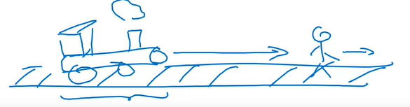

## Working with AI team
### Specify your acceptance criteria
- Goal: detect defects with 95% accuracy
    - Here accurecy have to be defined that it will be measured.
- Provide AI team a dataset on which measure their performanc
    - Even if data been provided, 95% accuracy totally depending on data provided amd how much data AI team needs.

### How AI team think about data
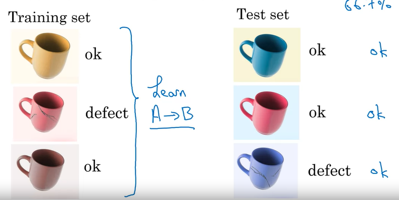

- There are 2 sets of data set
    - Training data: To train the AI model, usually much much larger then test daat set
    - Test data: To test the trained model to check the accurecy. 

### Pitfall: Excpecting 100% accuracy
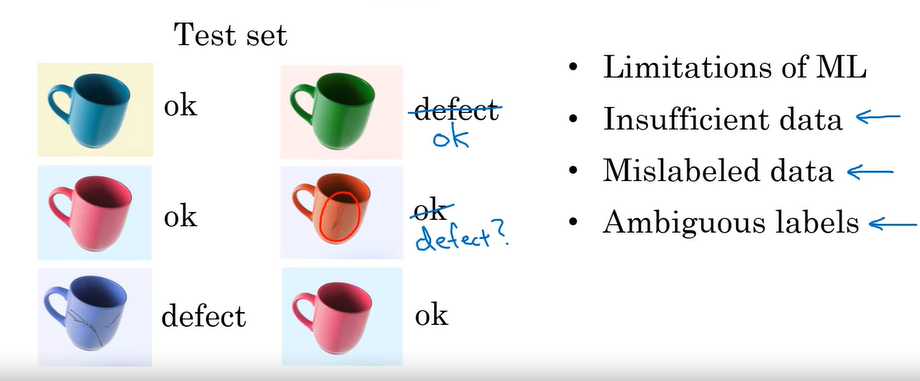

- Even we have a very large data set, there is a limitation of ML.
- Sometimes data could not be sufficient enough to train the model (more data can be collected)
- Sometimes test data could be mislabeled to wrongly labled
- Sometimes lable could be Amobiguous (small scratch on mug)

- <b> Still after all this, some AI models are very useful for business use cases, to optimize revenue at the end</b>

## Technical tools for AI teams
### Open-source frameworks
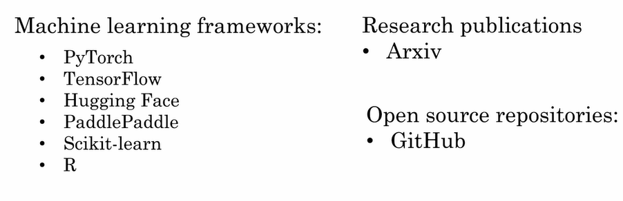

- Arxiv is a research pulication web site where new research on AI gets published.

### Edge deployment
- Data collection, machine to process the data and response used at same place
- Example: self driving cars
- On edge deployement, network becomes low and response is becomes faster at there is no network required.
- Edge deployment total depends on usecases and its advantages and disadvantages.
