# Building AI in your company
## Introduction
### Topic covered for building AI topic
1. Case study for complex AI products
2. Roles in an AI teams
3. AI transformation Playbook
4. Taking your first step

## Case study of smart speaker

- There are different voice commands to activate the smart speakers
- Here, we are going to use 'Hey device' to activate speaker
- Like, 'Hey device! Tell me a joke'

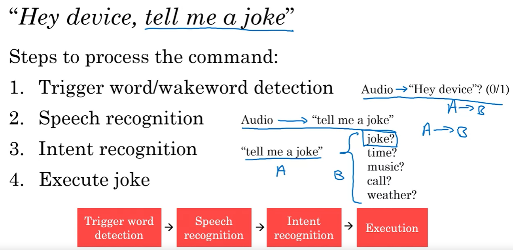

1. Speaker usage the audio clip as input and which having 'Hey device' have output. This is to detect the triger word
2. Whatever comes after 'Hey Device', using speech recognization ML, converted to text (trascript).
3. Now figure out the intent, what actually to be done.
4. After finding the intent, actually execute the output (like here, play a joke by selecting it rendomly)

### Hey device, set timer for 10 minutes

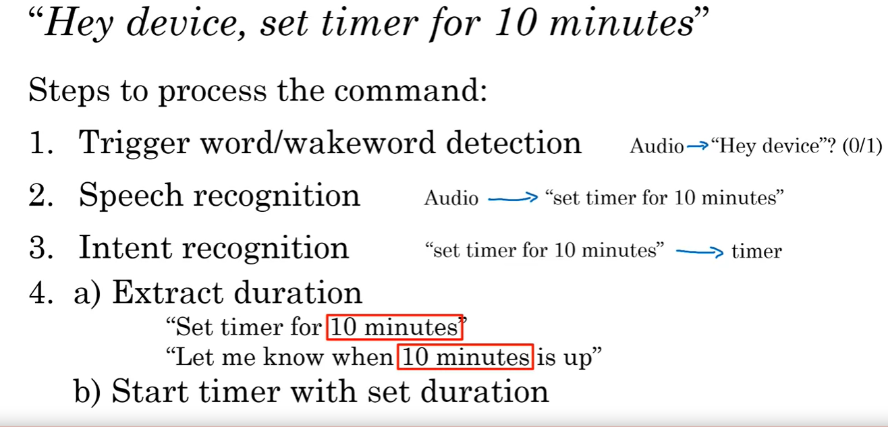

1. Detect wakeup trigger word 'Hey device'
2. Convert audio after 'hey device' to trascript.
3. Find the intent using transcript -> 'set timer'
4. Execution
    - Extract duration
    - Start timer with set duration

### Other functions
1. Play music
2. Volumn up/down
3. Make Call
4. Current time
5. Unit conversion
6. Simple questions
7. etc...

- Smart speakers can do many other tasks. All tasks are following same above 4 steps to execution of command.
- For execution of the command, developer have to write explict functions to perform the tasks.
- Smart speaker cannot do everything but can do when task is in smart speaker dommain.
    - Example of task cannot be done by smart speaker
        - Call my friends for dinner and confirm if they are coming.

## Case study: Self driving cars
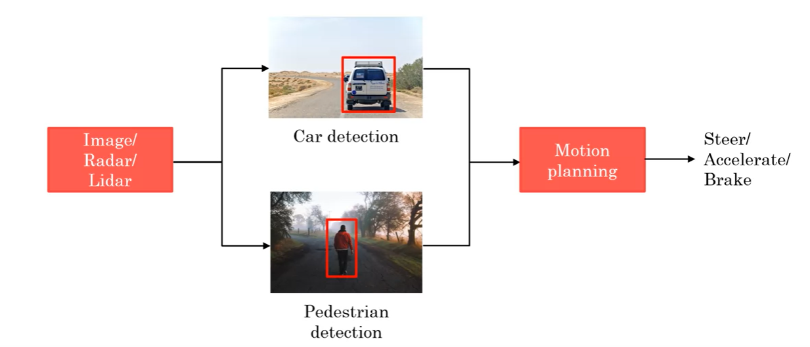

1. Car may use camera, radar, lidar etc to get position and image of an object.
2. Then using a ML algorithm, it detects other car or pedestrian (for sefty measures).
3. After detecting the same, motion planning can be done like Steer, Accelerate and Brake.

### Self driving in details

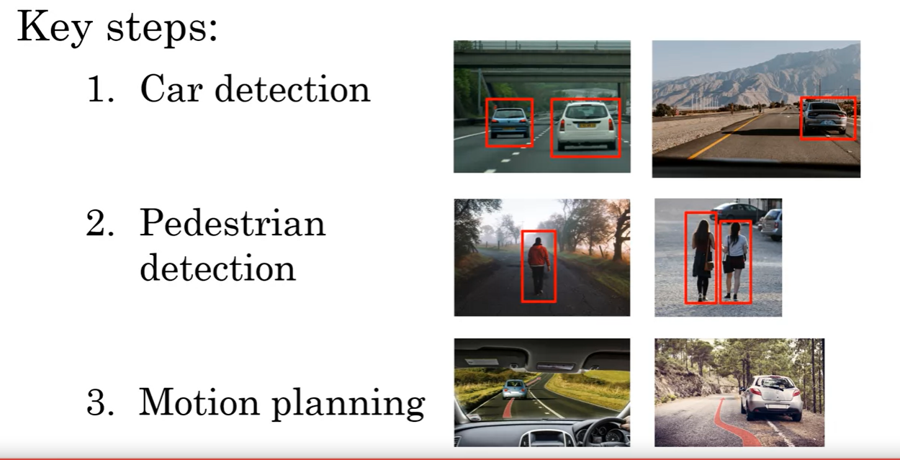

1. Car detection
    1. Some cars may use multiple cameras to detect objects like having camera on side of the car as well
2. Pedestrian detection
    1. Similer to the car detection, similar algorithm can detect pedestrians.
3. Motion planning
    1. After object detection, motion planning can be drown to follow.
    2. Like follow a line on the road.
    3. detect a car parked on one side of the road

### Steps for deciding how to drive
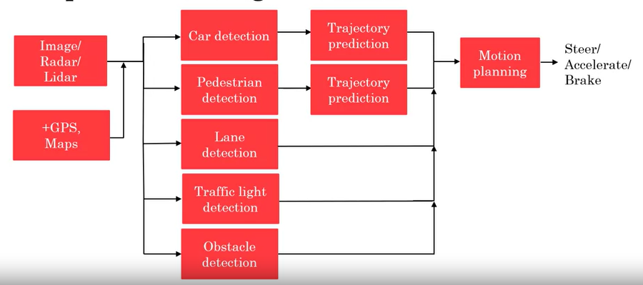

1. Cars usage image/radar/lidar and now a days GPS/Maps as a input.
2. Using above input, car detects others cars/pedestrian/Lane/triffic lights/obstacles
3. With above detection, trajectory predication (what is the next step) calculated.
4. Based on trajectory, motion planning (steer/accelerate/brake) can be done.

## Example roles of an AI team
- Roles for machine learning team is still not very clear
- With example, it can be easier to understand the roles

#### Software engineer
- Writting the actual program that will execute the instruction.
- Example, joke execution, self driving tasks execution etc.
#### machine learning engneer
- Provide mapping og input A to output B using machine learning model
#### Machine learning researcher
- Find new and more efficient techniques to run a machine learning project or module.
#### Applied Machine learning scientist
- Role is a combination of machine learning engineer and machine learning researcher

#### Data scientist
- Examine data and provide insights for the data to business.
- Make a presentation to executives/teams to make them aware of the insights
#### Data Engineer
- Organize big data in most optimized and efficient way
- Make sure that the data saved is easily accessible, secured and cost effective.
- When data become larger and larger, storing data in a efficient way becomes more and more difficult
#### AI product manager
- Help to decide, what to build, what is valuable and feasible

### Getting stated with small team
- For a start, a software engineer or machine laerning engineer or nobody but just one person is enough to get started.

## AI transformation playbook 
- AI trasformation can involved multiple steps to start a project

1. Execute pilot project to gain momentum 
2. Build an in-house AI team
3. Provide board AI training (including executives)
4. Develop AI startegy 
5. Develop internal and external communication

### Eleboration of above steps
1. Execute pilot project to gain momentum
- More important for initial project to get successful rather than most valuable
- This new prject may take 6-12 months to become successful
- The first project can be outsourced to gain momentum or can be build in-house if have experties

2. Build an in-house AI team
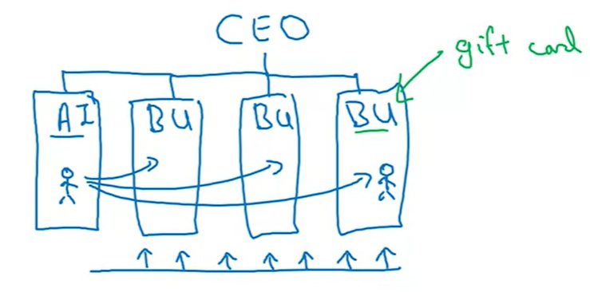

- AI team can be shuffled under multiple business units to take advantages to the AI to existing projects.
- Those muliple AI team can be under CTO, CIO, CDO.
- Later on these teams can be align with CAIO.

3. Provide board AI training
- Executives and senior business leaders roles
    - What AI can do for enterprice
    - Develope AI strategy
    - Resource allocation for AI projects
- Leaders of divisions working on AI projects
    - Set project direction (Technical and business diligence)
    - Resource allocation of AI projects
    - monitoring the progress on the AI project
- AI Engineer trainees
    - Build a ship AI software
    - Gather data
    - Execute on specifice AI projects

4. Develop AI strategy
- Leverage AI to create an advantage specific to there industry sector.
    - Develop an AI strategy is a 4th step as startegy can be defined properly only after gaining knowlage of AI.
    - Design strategy aligned with the "Virtuous cycle of AI"
        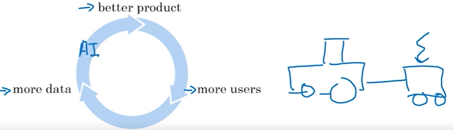
    
    - Example:
        - If a company having a good product (website), company can use AI strategy to make it better.
        - Or a new company can also build a website from scratch, collect some small amount of relavent data and feed it to AI to make there product better.
        - Once a setup of the cycle is done, with more user, more data can be collected and feed to AI model to make even better product.

    - Consider creating a data strategy
        - Strategy data acquisiton
            - Collect data indirectly.
            - Example: Photosharing app
        - Unified data warehouse
            - Many data warehouses are not useful for find a cause.
            - Example: Temprature may affect a mobile to have a defect in it in comming future...

    - Create network effects and platform advantages
        - In industries with "winner take all" dynamics, AI can be an acceleretor
        - Like uber connects drivers and passengers
        - AI can be used to increase the value of the product or if we have a high value product, AI can be used to have a higher value product

5. Develop internal and external communication
- Investor relation
    - Invesor properly recognize a company as a AI company
- Government relations
    - Health care, finance, self driving cars etc. can be collecborated between govenrment to protect consumers for private data sharing.
- Customer/user eduction
    - This is very import to have AI communication properly
- Telant/recruitment
- Internal communication

## AI pitfalls to avoid

Don't: | do
--- | --- 
Expect AI can do everythink | Be relalistice what AI can and cannot do with given limitation of the technology, data and engineering resources
Hire 2-3 ML engineer and count on them to work sololy | Pair engineering talents with business talent and work cross functionally to find feasible and valuable projects
Expect the AI project to work in first time | Plan for AI development to be an iterative process, with multiple attempts needed to sucessed.
Expect tradition planning process to apply without any changes | Work with AI team to establish timeline estimates, milestones, KPIs etc.
Think you need a best AI engineer to get started | Keep building the team but get going with the team you have

## Taking your first step in AI
- Get friends to learn about AI
- Start brainstorming projects
- Hire some ML.DS people to help
- Hire or appont an AI leader (When already started, AI lead, CAIO etc)
- Discuss with CEO/borad possibilities of AI transformations

## Survey of major AI application areas
### Computer vision
#### Image clasification/Object recognization
- Provide a picture of a cat to AI model and ask to recognize the image to model.

- Face recognization
    - User may register a face to unlock the door
    - AI model may ask of multiple pictures to recognize the face

    

#### Object detection
- Another application of AI is object detection and find positon of those objects.
- Object detection also detects whether object is a predestrian or a car or other object.
- Depending on the image provided and object type detection, it may have some output or not.

#### Image segmantation
- It draws the boundary of pixel that which pixels are belonges to which object.
- It draw the boundary of pixel. 

#### Tracking
- A video can be used as a input to find predestians and track there position changes.

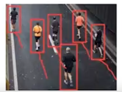

### Natural language processing
#### Text classifiction
- Find email is span or not
- Find product category using product description
##### Sentiment recognition
- "The food was good" -> 5 star
- "Service was horrible" -> 1 star
- Find a review besed on comment/feedback provided by customers

#### Information retrival
- Some compies have search service to retrive internal document or data using search.
- Web search is one of the example for information retrival using search

#### Name entity recognition
- Recognition of person names in a paragraph
- Recognition of place names in a paragraph
- Etc.

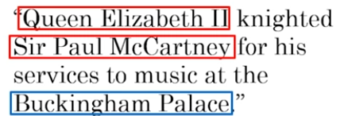

#### Machine translation
- Translate text from one language to another

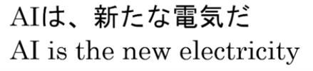

### Speech
#### Speech recognition
- Convert text to spech
#### Trigger word/wake word detection
- Detect the word to wake the device for further instruction
#### Speaker ID
- Same as face ID, with speech, speaker ID can be assigned
#### Speech synthesis (TTS)
- Convert text to speech

### Generative AI
- AI system that can generate high quality text, image, audio
#### Text generation

#### Image generation
- Generate high quality image wit text instruction

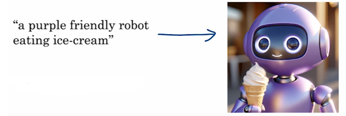

#### Audio generation
- Generate audio (Speech, music) using text instruction
- Example: Drum solo 140 bpm

### Robotics
#### Perception
- Check what all things around to make decision
- Radar and lidar are most used systems to detect objects around.

#### Motion planning
- Using data, find the path to follow

#### Control
- Sending commands to motor to follow path and control the speed or motion

#### General machine learning
##### Unstructured data
- Easy to understandable by human but difficult to process by AI

##### Structured data
- Producing much value for analysis
- Easier to process

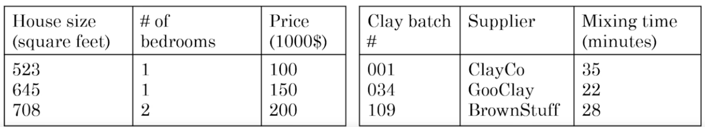

### Unsupervised learning
#### Clustering potato chips sale
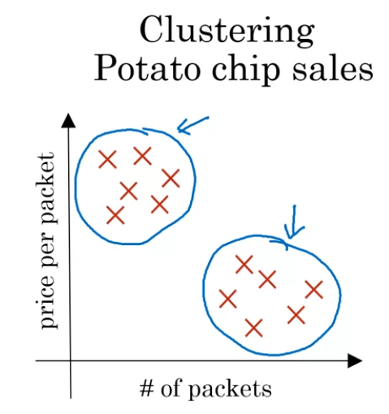

- High price potato chips have low saling rate and low cost potato chips having higher saling rate.
- Example: low cost potato chips may have high sale near to a collage and high cost potato chip may have high sale near to a residence area.

#### Youtube videos output using unsupervised learning
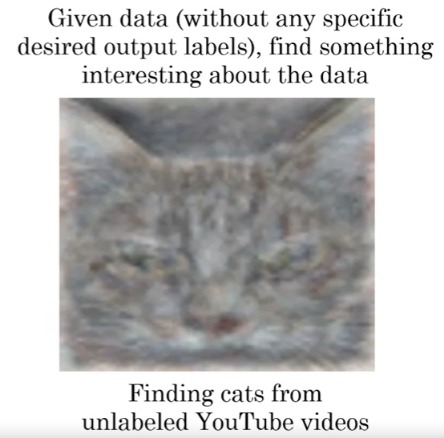

- When large data of yoututbe videos been passed to unsupervised learning model, it has provided a cat image as most of the videos of youtute have cat in it.
- Unsupervided learning may provide a surprising results somtimes.
- criticisms of supervised learning is, it requires a lots of data to train the model.
- Ex. train a model to find a cup. we may need 10k or 100k images of cup to train to model which a human kid can learn in very small amout of cup count.

### Transfer learning
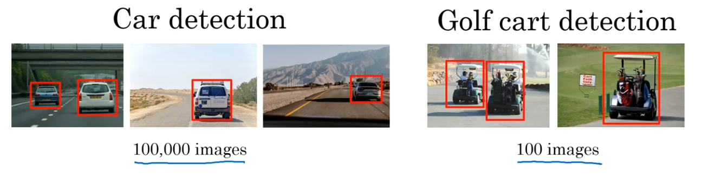

- A model been trained using 100000 images (very large dataset).
- A new may not have same cars with which the dataset been trained for cars.
- Using transfer learning, model can be trained using small amount of data (100 images of golf car) as model already know of cars drives, how wheels look like and so on.

### Reinforcement learning

- Reinforcement learning is a learning by a rewards (true/false)
- If a model behaving as expected, a positive reward can be provided
- If the model behaving not as expected, negative rewards can be provided.
- Such learning required a huge amount of data.
- Currently, programs finds supervised learning is a better approch for tarining a model then reinforcement learning.

### GANs (Genetive Adversarial Network)
- Generate new images using already existing images.

### Knowledge graph
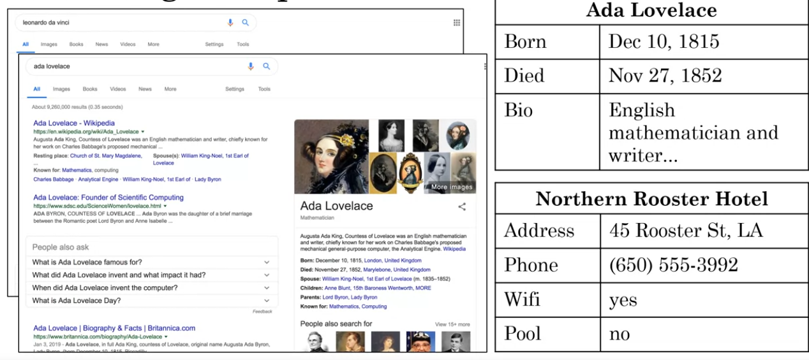

- Database of specifice category like, person info, hotel info, flight info etc.
- Knowlage graph is a very valuable informaion and companies earns a lot of revenue using such data.

