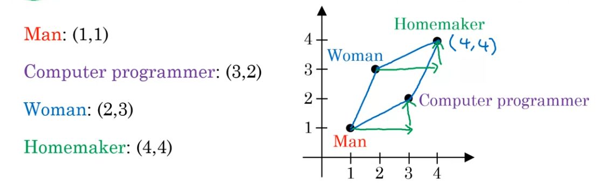
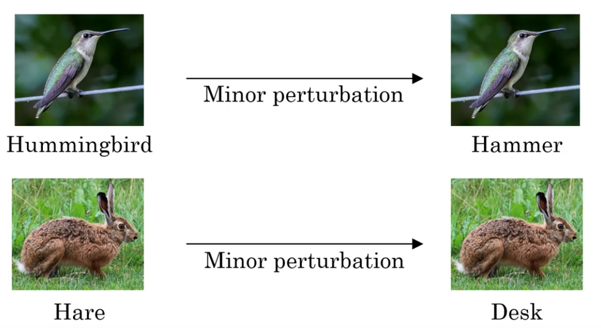
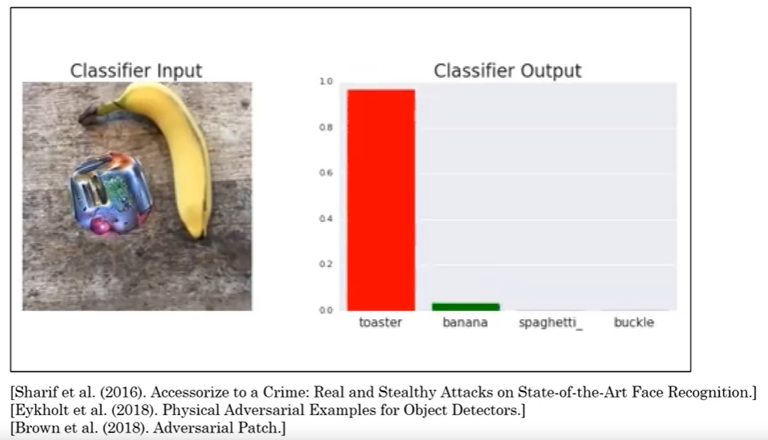
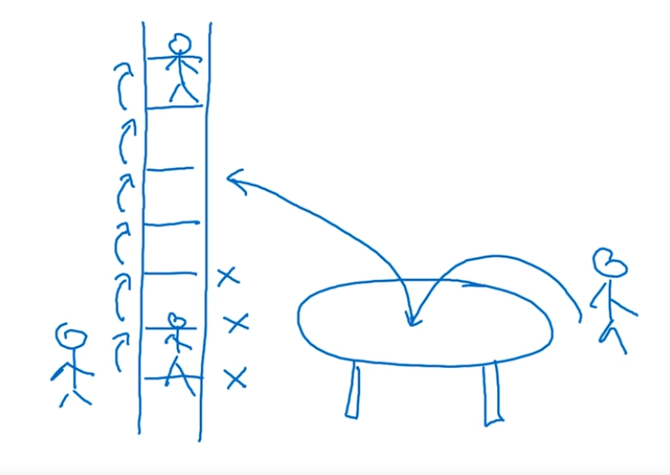
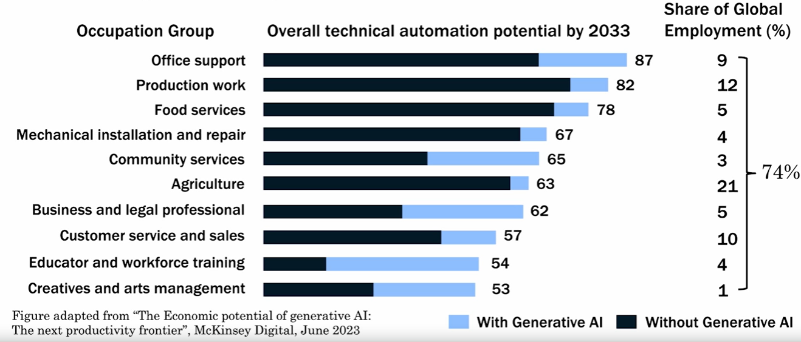

# AI and Society
## Introduction
- This chapter will be comvering below topics
- Topics
    - AI and hype
    - AI and Ethics
        - Limitations of AI
            - Bias
            - Adversarial attacks
        - AI, developing economies, jobs
    - Conclusion

## Realistic view of AI
### Goldilocks rule of AI
- Too Optimistic:
    - AI will slove all humanity problems and create utopia 
- Too pessimistic
    - Super intelligent/sentinal AI will lead to human extinction.
- Just right:
    - AI is a powerful tool but has limitations. We can mitigate its potential harms and use it create tremendose value.

### Limitations of AI
- Performace limitation
    - AI modelling required huge amount of resources to run it.
- Explainability is hard (but sometimes double)
    

    - Above image is a digonosis of right-sided pneumothorax.
    - To explain how this has been detected, AI generated an another image (color) to explain.
    - Sometimes how the object been detected is difficult to explain.
    - For human as well, explain how objects been identified is difficult to explain.
        - Ex. Explain a coffee mug is a coffee mug!!!
- Baised AI through baised data
    - AI results could be baised and discriminated based on gender or affinity if those values are not provided in the data.
- Adversarial attacks on AI
    - AI systems can be attacked by individuals if they deliberately whats to.
    - Some examples includes, open AI systems.

## Discrimination / Bias
-  Sometime result from AI model could be biased based on search done on internet text.
### AI learning unhealth stereotypes
- The study been done by microsoft when a learning on model been done using contents available on internet
- When finding a streotypes using the model
    - Man: Woman as Father: ? (Mother) --> OK
    - Man: Woman as King: ? (Queen) --> OK
    - Man: Computer programmer as Woman: ? (Homemaker) --> Not OK
        - This is biased answer for this model and less biased answer could be a <b> Computer Programmer </b> for Woman as well.

- This could be explained by a below statistics

- Here Man to Computer programmer found using 1->3 via X axis and 1->2 via Y axis.
- Similerly, for Woman to Homemaker found using 2->4 via X axis and 3->4 via Y axis. (which is biased)

### Why bias matters
- Hiring tool that discriminated against Woman.
    - A company found that there AI hiring tool is discreinating between woman and man candidates for hiring and company has discontinue the tool.
- Facial recognition working better for light skin than dark skin individual
    - This could lead to biased decision while have criminal invetigation.
- Bank loan Approval
    - In some cases, minorites in community could have higher intrest rate which is biased.
- Toxic effect of reinforcing unhealthy stereotypes
    - A girl child search for CTO and found only pictures of males.
    - It could lead to think that only male can be a CTO.

### Combating bias
- Technical solution:
    - 'Zero out' the bias in words to reduce bias significantly.
    - Use less biased and/or more inclusive data.
- Transparency and/or auditing process
    - Transparency in system can help to reduce biased in the model.
    - Regular auditing may detect some biased behavier and fix them.
- Diverse workforce
    - Divercity may have in many prospect as they can see many ther aspect of the application and detect problem earlier.
     
## Adversarial attacks on AI
- Attack that intented to target a AI system provide false information.

### Example

- first example is a hummingbird. with some changes in pixel, it AI model results as Hammer, even if the picture is looking the a Hummingbird in human prospect.
- Second example is of Hare, with some changes in pixels, Hare image results as Desk.
- For attacking the system, someone can change an image before sanding an email.

### Physical attack

- 1st pictutre, A university designed a pair of glasses to fool AI and AI resulting a female actress name "Milla Jovovich" insteed of the actual male name.
- 2nd picture, When someone stick some stickers on stop sign, AI stoped detect STOP sign. This could be a big issue for self driving cars
- 3rd picture, it is a picture of banana. if palaced an another object with this, AI stop classifing the banana but classify something else.

- When placed a sticker, this picture is not getting classified as banana but as toaster.

### Adversarial defence
- Defence do exists but incur some cost on performce. Research is on going to reduce the cost for defending adversarial attack with less cost.
- Similar to spam vs. anti-spam, we may be in amrs race for some applications.
- For some application, defence mechanism may not be required but for some it is mandatory like banking applications.

## Adverse uses of AI
- Deep fake
    - Synthesize video of people doing things they never did.
    - Creating a fake video of someone and post it in social media could cause serious problems with that person.

- Undermining the democracy and privacy
    - Oppressive serveillance
        - Government wants to impove citizens life but they could be oppressive to uplifting the serveillance.

- Generating fake comments
    - AI can be used to generate fake comments as well on any website like flipkart, amazon, social media etc.

- Spam vs anti-spam and fraud vs anti-fraud
    - AI is still evolving to filter spams and detecting fraud.

## AI and developing economies
### Developing economies

- All developing economise starts with small area of manufacturing.
- farming, small products company, automobiles etc. and becomes a developed economy.
- Some of the lower steps cannot be done by AI or automated by AI but higher steps can be automated.
- Some developing economies already jumped to newer technologies by jumping directly to it.
    - Mobile phone adoption instead of landline
    - Mobile payment instead of emphasizing on credit card payment
    - Online eduction instead of physical eduction due to infrastructure setup.

### How developing economies build AI
- The US, China, UK, canada and many others have vibrant AI communities. But all contries still have a lot development ahead.
- Focus on AI to strengthen a countries vertial industry.
- public-private partnership to accelarate development.
- Invent in education

## AI and jobs
### AI's impact on jobs worldwide
- New jobs for AI to automate tasks will be created

- Jobs maybe automated in 2033 with AI

- This chart shows job that the most of the part will be automated.
- Globally 74% job maybe automated with AI.

### Some solutions to safeguard citizens from coming changes from AI
- Conditional basic income: Provide a safty net by providing some incentive but requries continous learning to get a new job.
- Lifelong learning: Today's continuously changing world, 4 years of degree course from 30 years is not enough. Without continuously gaining new knowlage, jobs maybe not be available for obselete knowladge.
- Political solution: Make sure that people are treated fearly.

## Conclusion