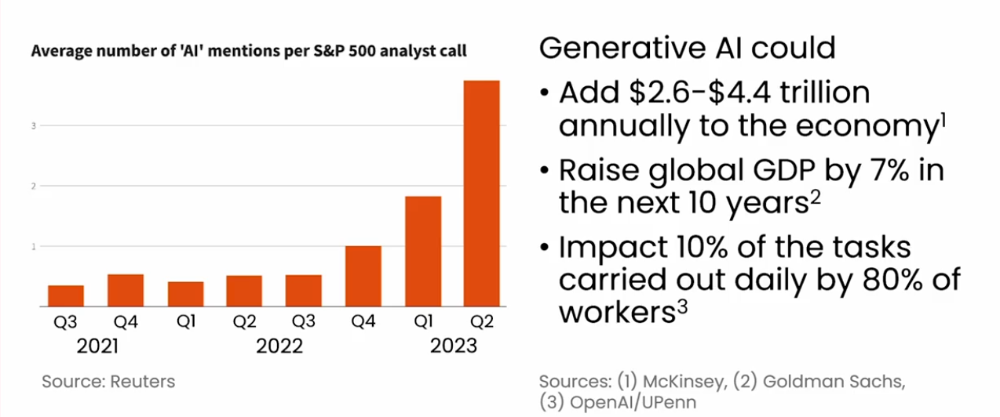
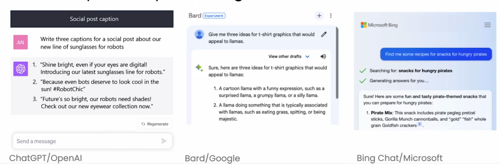
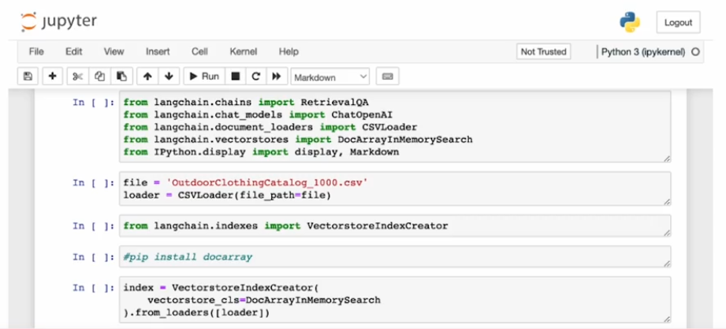
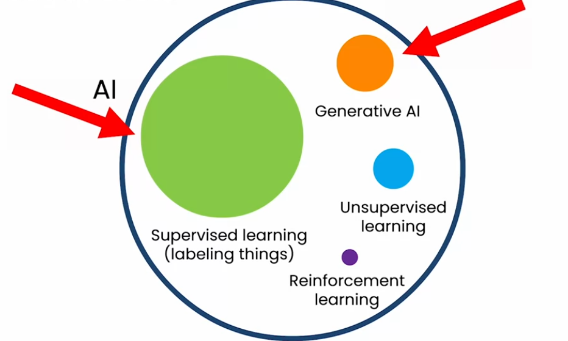
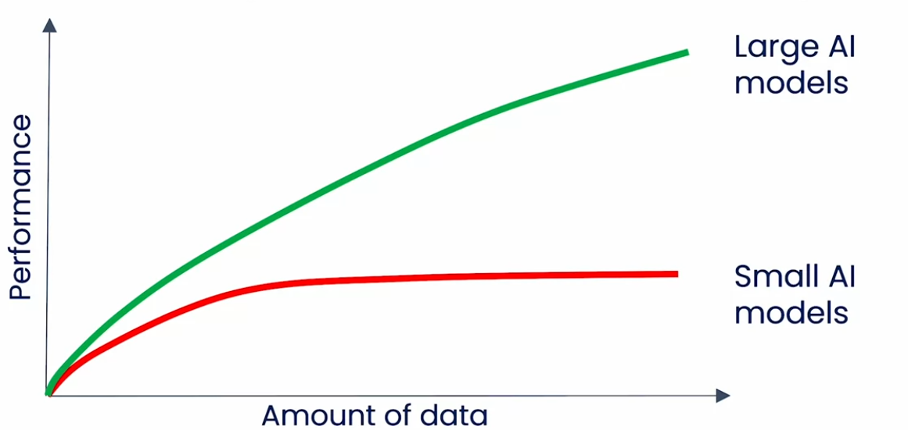
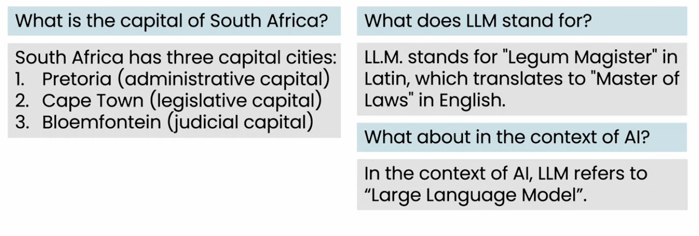
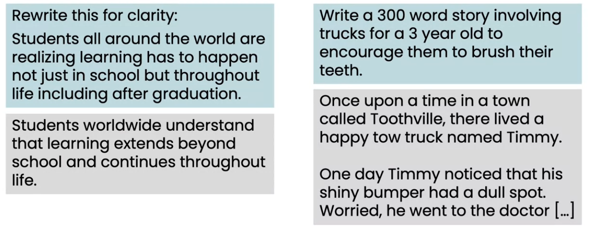
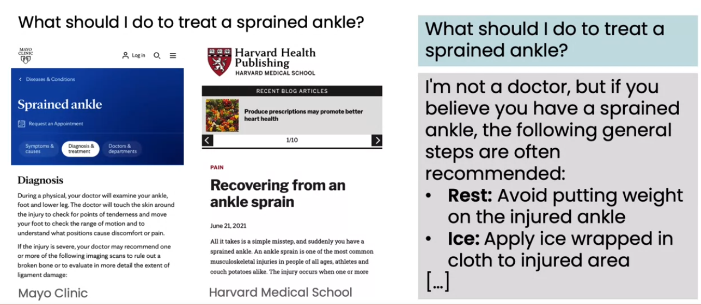
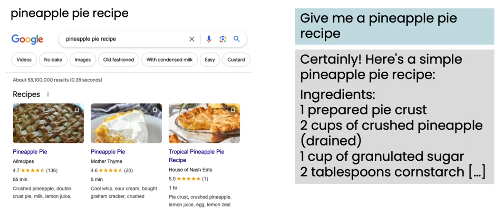
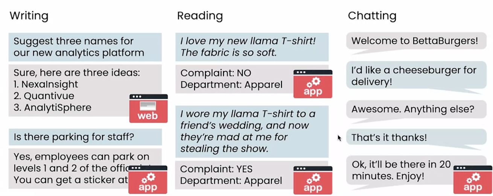

# What is generative AI

### The rise of generative AI
- Generative AI got its popularity after openAI launch chat GPT.

- AI system that can produce high quality contents like text, images and audio.

- ChatGPT ,Brad/google, Bing chat/microsoft are some examples of genAI which accepts the propt and generate the response for the same.

- Use generative AI in a developer tool can be more powerful and impacting as well for jobs

### AI is already prevasive in our lives
- AI is already affectiving and helping in day to day activity in our life.

| AI technology | Examples |
| --------------| ------------| 
| Web search | Google, bing |
| Fraud detection | Credit card payment (done by same person or different person) |
| Recommender System | Amazon, Netflix |

### Image, audio and video generation
- Gen AI can generate an image using a prompt

- Similerly, Gen AI can clone the audio and video or both togather

## How generative AI works
- Generative AI is build on superwised learning. as it maps a input to output.

### AI is a set of tools

### Large scaled supervised learning

- There is no performce improvment on small AI model even if we feed more and more data in it.
- On other hand, when we have large AI model with high resources to train it, performnce and accurecy increase to next level.
- Large AI models are used in GenAI

## LLMs as a throght partner
### A new way to find the information

- There could be a new way to find information using LLM
- LLM could provide infomation which may not relevent if context not provided

### Writing partner

- LLM is very good with re-writing lines or information
- LLM can write a good story (not best) on providing a context

### Web search or using an LLM?
1. What should I do to treat sprained ankle?
- Web search having good result in this case.
- in image, left is web search and on right LLM search

2. Web search on 'pineapple pie recipe'
- Web search having best result in this case as we can go throgh web pages with a good cafe's recepe.
- in image, left is web search and on right LLM search

3. Web search on 'coffee-infushed pineapple pie recipe'
- LLM having better answer in this case as this is a specific case where we do not have very good results from web search
- in image, left is web search and on right LLM search

## AI is a general porpose technology
- Like electricity, AI is also useful for many things. As electricity can be used in different purpose, so the AI also can.

### Example of LLMs can carry out
1. Writing
- Asking question to LLM and get the answer back (web search)
- If LLM having access to Employer's company, than it can answer company specific questions (APP for employer)

2. Reading 
- Check if comment is a complaint or not. (APP)

3. Chatting 
- Ordering something using chatbot (APP)

