# Generative AI applications

## Writing
- Provide a prompt to LLM to generate some text answer

### Brainstroming product names

- We are having examples of new names of peanut butter cookies

### Increase cookie sales

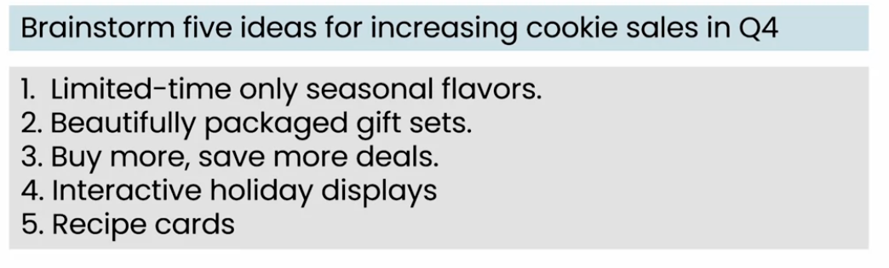

### writing a press release
- Welcoming a COO from press release
- Here, limited information provided to LLM to generate text

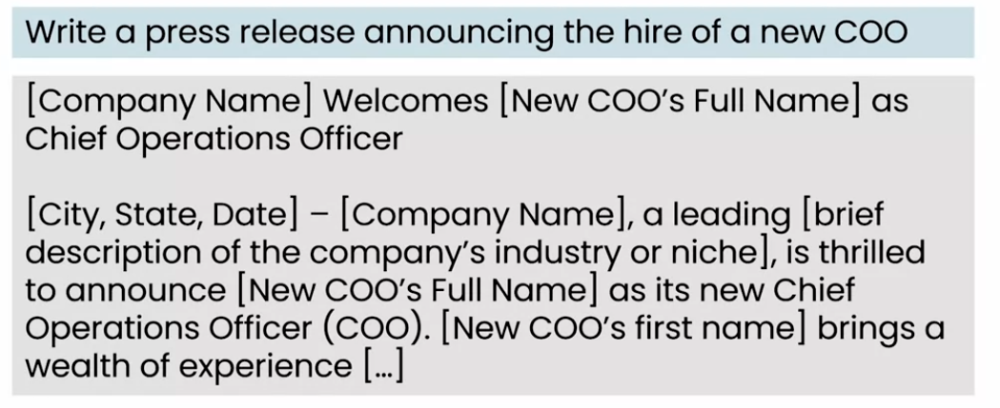

- With more information on COO and company releated information, LLM can generate more precise result.
- Sometimes LLM may have not very good result at first time but on refresh, it can have better results.

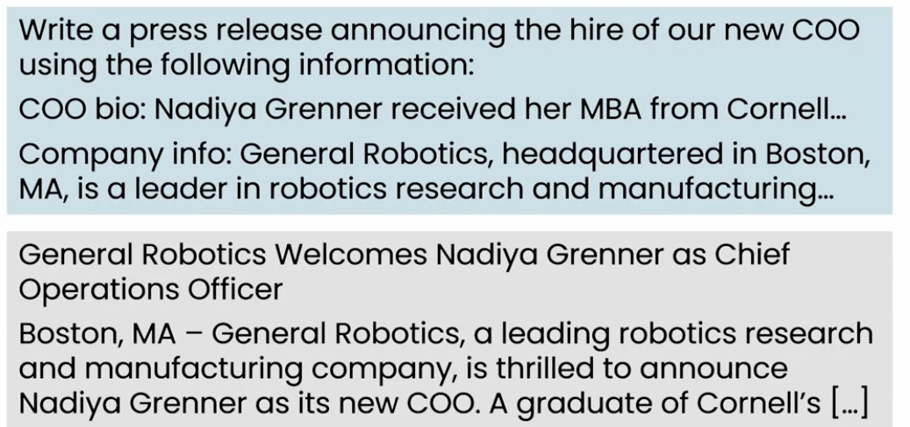

## Translation
- LLMs are very good at converting one language to another
### Convert english to hindi
1. Convert english to formal hindi

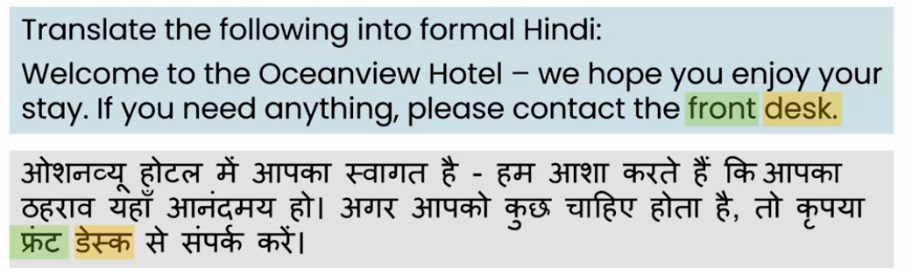

2. Convert english to formal spoken hindi

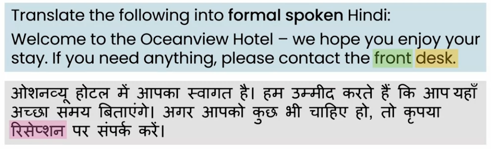

- There is a conversion difference on providing different prompts to LLM

3. Pirate english

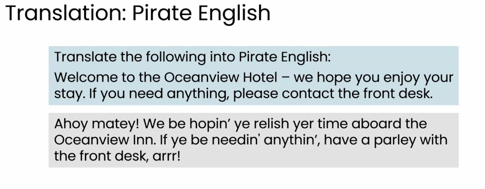

## Reading

- Fixing some text or correcting some paraghraph

### Proofreading

- LLM can read the text and correct grammer and spelling mistakes which can proof the reading.

### Summarizing the article

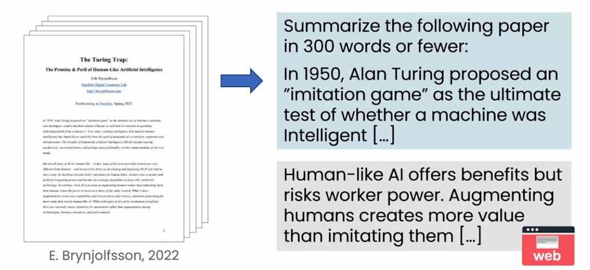

- LLM can sumarize the article of 300 pages to 300 line by reading the article.
- Web interface can be ok for such action

### Summarizing call center conversation

- If call center can record the call or conversation in a transcript, it can be convey to manager for analysis.

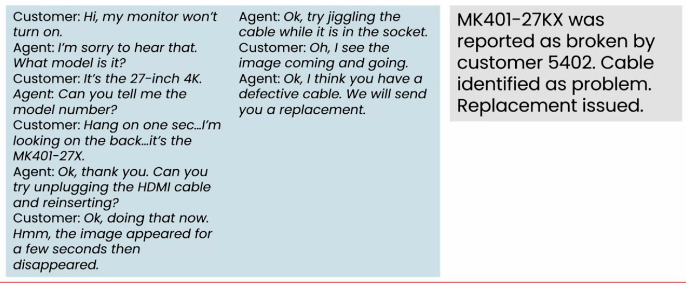

- If a conversaton having to much text, it will be difficult to analysis the issue using all thise text.
- LLM can summarize the text to short form which can help manager to get overview of the issue.

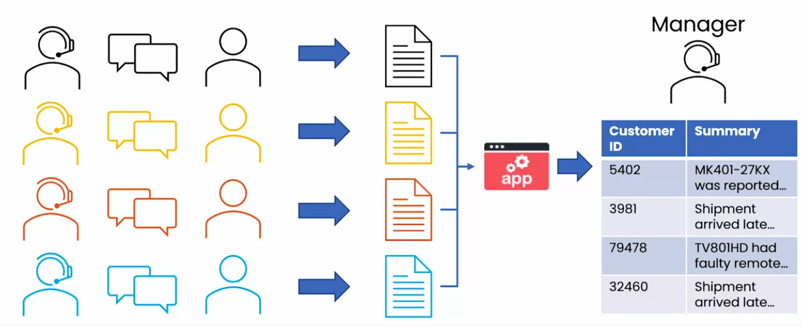

- If there are multiple call handler to handle multiple customers, a app can get those transcript and summarize those from manager to read them.

### Customer Email analysis

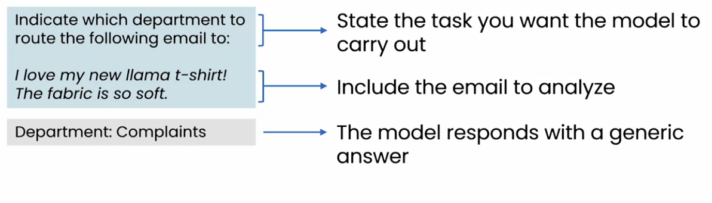

- To route the email to consern team, LLM can be provided with the prompt.
- If prompt does not have available departments list, it can redirect the email to not existing department.

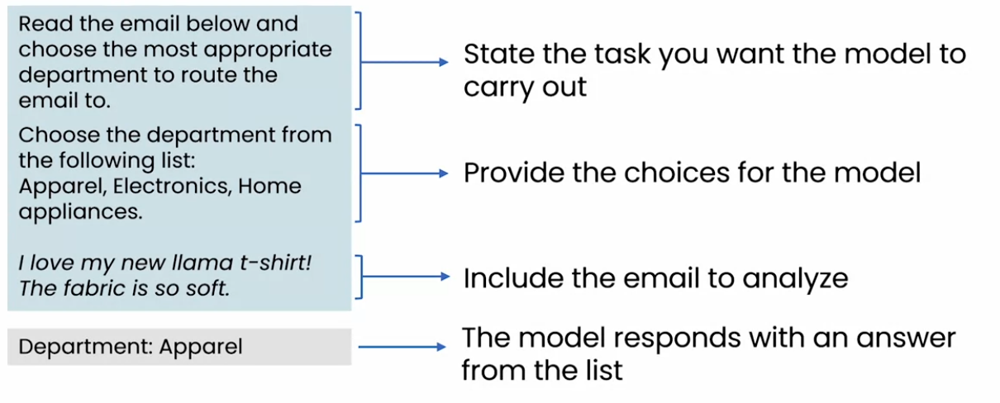

- Here list of available departments/context been provided to divert mail to the department.
- Just by changing the prompt, LLM response changed to the correct response.

### Reputation monitoring

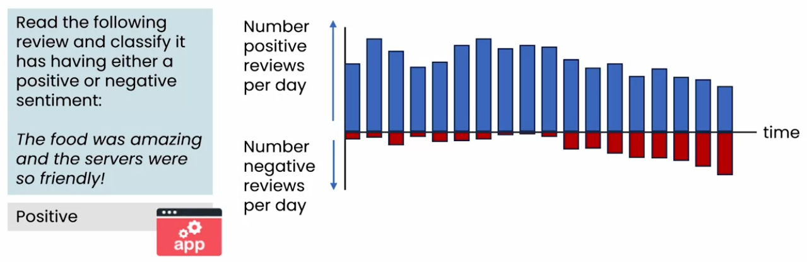

- LLM can read comments and find if the comment is positive or nagative.
- User can build a dashboard on it to know daily update on positive/nagative comment and get alart if negative comments are getting increased.

## Chatting
- There are so many chat application already exists like chatGPT, bing and others.
- Sometimes company wants chat applications for a special purpose

### Specialized chatbot

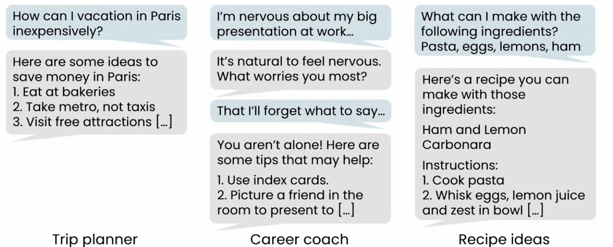

- Specialized chatbot can be used in traval planning, career coach, receipe idea and so forth.

### IT service chatbot

- IT service person may get multiple requests to reset password.
- specialized chatbot can handle it by reading such request and perform required action on it.
- Chatbot have to be configured with verifing the identity.

### The rise of chatbots in customer service.

- There could be multiple kinds of IT service configuration to handle customer requests.

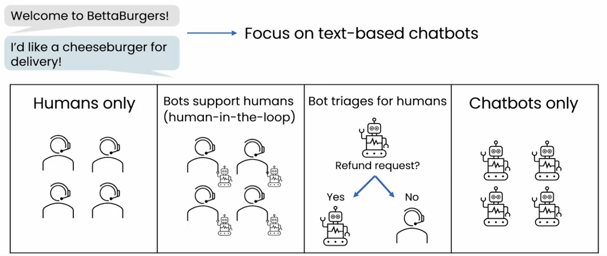

- Humans only
    - Human replying to the customer
- Bots support human
    - In the configuration, chatbotgenerats the reply but human sends the message after verifing it
    - This configuration is, to avoid to have wrong reply to the customer
- Bot triages for humans
    - In this configuration, bot can resolve some simple problems and forword other complicated problems to humans.
- Chatbot only
    - Chatbot only reply to the customer

### Advice to deploy chatbots
- Start wth internal facing chatbots
    - Deploy chatbot for internal usage only.
    - On confirmation that chatbot works fine, we am deploy it as human-in-the-loop configuration.
    - When chatbot answers mostly right answers, deploy it to public.

## What LLMs can and cannot do
### What prompting an LLM can do
#### Ex. Can a fresh college graduates follow the instructions in the prompt to complete the tasks

- Can they determine if a email is a complaint? (Yes they can)

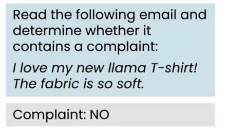

- Can they determine if a review is positive or negative (Yes they can)

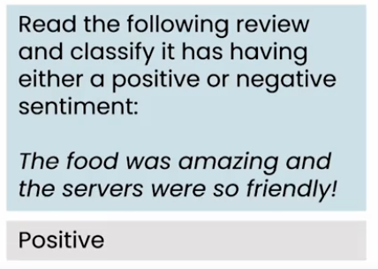

- Can they write a press release withput any information about COO or company? (No, it may not be relavent for press release)

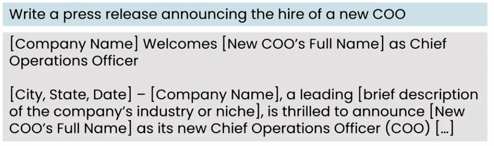

- Can they write press release if provided basic information? (Yes, they can)

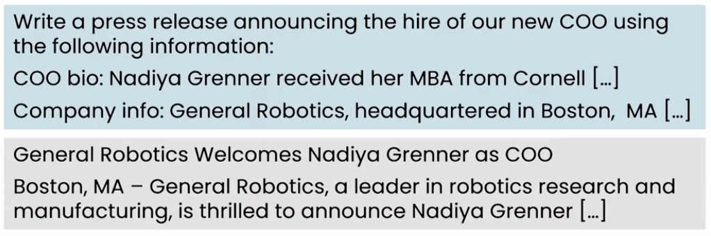

### Knowledge cutoffs

#### LLM's knowledge of the world is froozen at the time of it's training
- A model been trained on data scraped from internet on January 2022, has no more information on recent events.

- Claims of room temprature superconductor LK-99

### Making thinks up: Hallucinations 

- Shackespears said something about Beyonce (Beyonce was no more them before shakespeare)

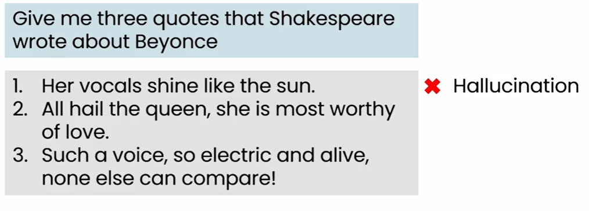

- Court cases example

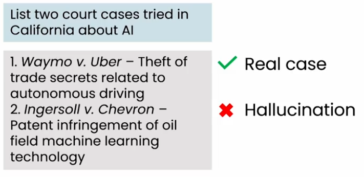

- Lowyar presented Hallucinated case generated from ChatGPT

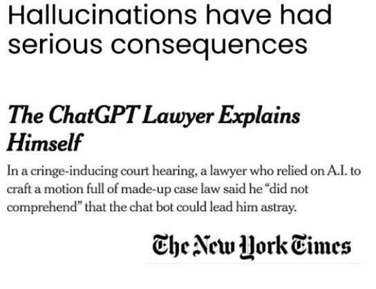

### Input (and output) length limitation

- Many LLMs only accepts few thousands words as a input.
- Total amount of context you can give it, is limited
- Some LLMs have higher text limit like 100000 words
- An LLM contexts length limit is the limited on total work on input+output

### Generative AI does not work well with structured data

- If Home prices or purchases on websites prices provided to generative AI, it may not be very efficient to provide a better results
- In this case, supervised learning is a better approch to process structured data.

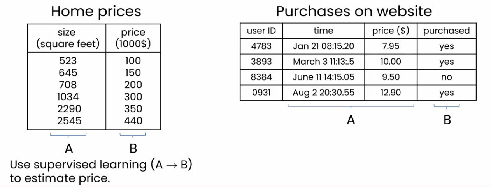

### Generative Ai works well with unstructured data.
- It work well with text, images, audio, video etc.

### Bias and Toxicity
- An LLM can reflects bias that exists in the text it learned from.
- It can be biased on gender prediction

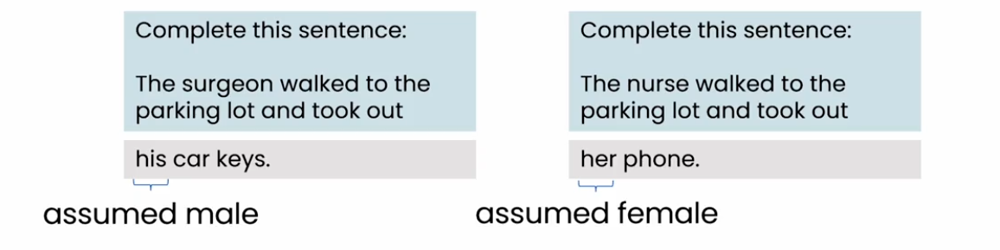

- If above sentances provided to LLM to complete them, LLM can be biased on it's answer.
- Surgon and nurse could be male or female, irrespective of there gender.

## Tips of prompting
### Be detailed an specifice
- Give a sufficient context for LLM to complete the task
- Describe the task in detail

### Guide the model to think through the answer
- Brainstorm the 5 cat names for a new cat toys
    - Step 1: Comeup with 5 fun, joy fun words that relate to cat
    - step 2: For each word, come up with a rhyming name for a toy.
    - step 3: For a each toy name, add a fun, relavent emoji.

- Response from LLM could be in this case is

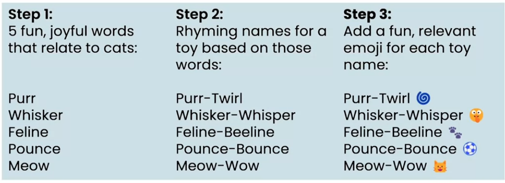

### Experiment and iterate
- No perfact prompt for every person or situation
- Instead, prompt can be improved through multiple iteration to get desired results

- Prompting process
    - Be clear and specific in prompt
    - Think about why result is not a desired answer
    - refine your prompt
    - Repeat

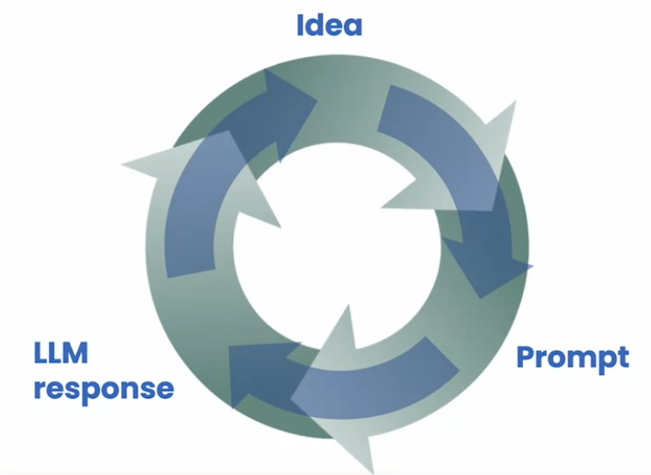

- Do not provided confidential information to LLM
- Do not blindly trust on LLM

## Image generation
### Example of generated images

- By providing a prompt, generative AI can generate some beautiful pictures
- Duffusion model been used to generate those images

#### Image generation (diffusion model)

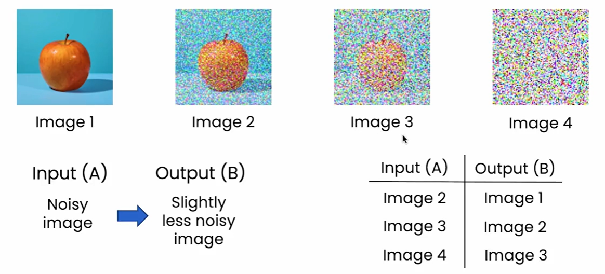

- Take a image
- Add more an more noise to it
- Store image with noises with mapping in reverse order

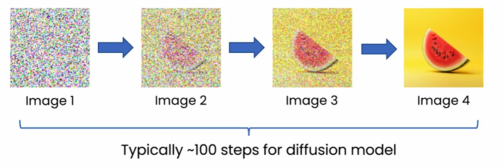

- When a prompt received to generate a image, it uses reverse image generation process to generate a image.
- Maybe few 100s steps requires to generate such images

- Adding text with above process can teach diffusion model to identify and response with expected image.

