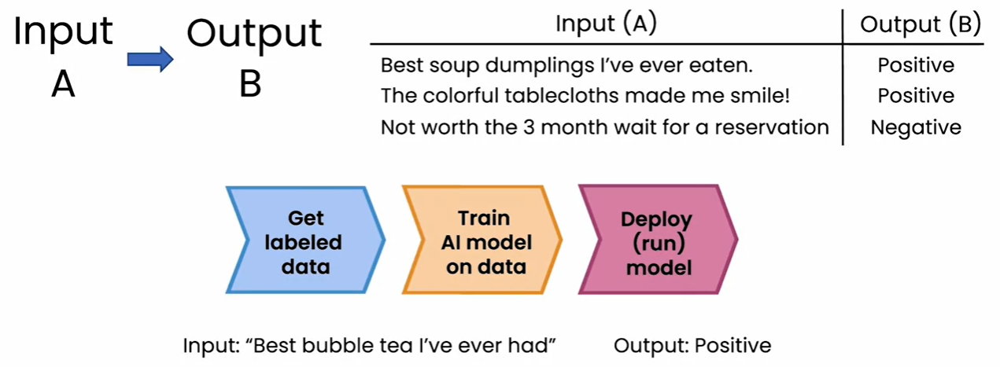
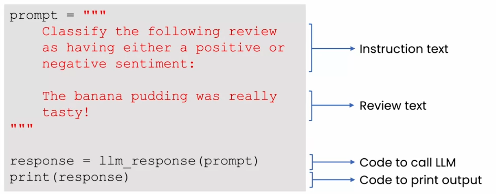
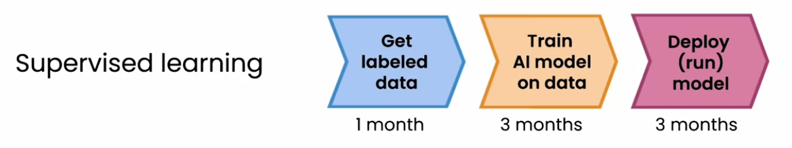
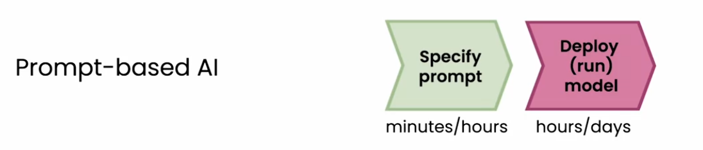
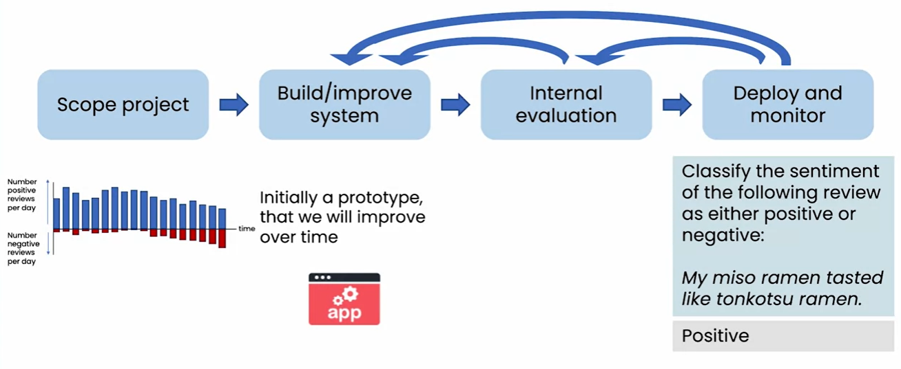
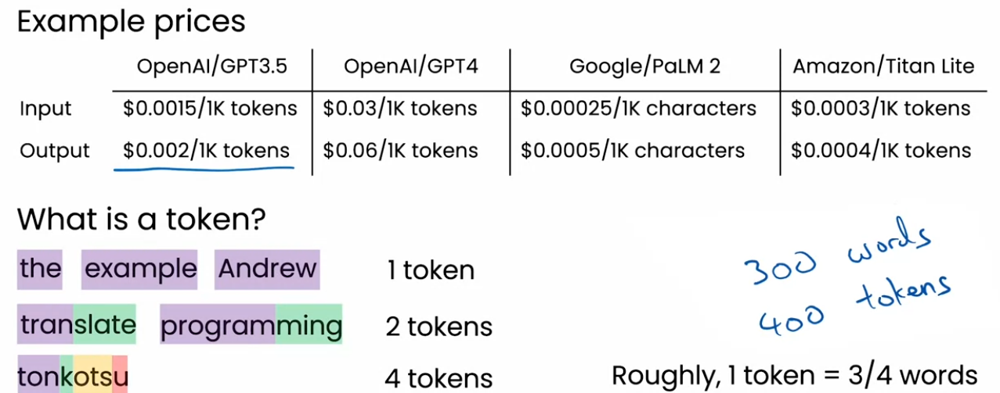
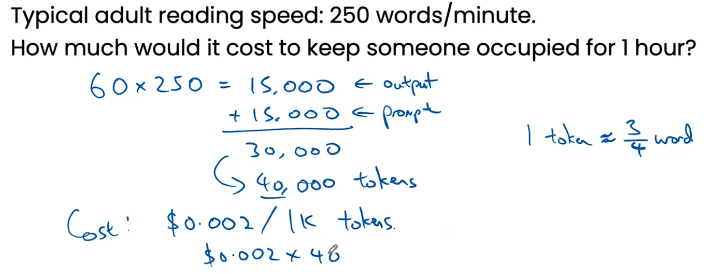

# Software applications

- There are 3 examples of AI application
1. Reading
2. Writing
3. Chatting

- Above applications were already exists before AI as well but generative AI made those application creation easier

### Superwised learning for restaurent reputation monitoring

- Company/AI enegineer have to collect a large data of comments and map them for input and output
- This process usually takes months to develop

### Propmt-based development

- This approch is very simple and takes minutes/hours to build.
- We just need to call LLM with precise prompt and it can provide the result.

### Workflow using generative AI
#### Traditional approch

- Traditional approch takes much larger time to build and deploy the model.

#### Prompt-baised AI

- Prompt based AI is simpler and taked much lesser time to build and deploy.

## Lifecycle of a generative AI project

- Assume we are building restuarant application using AI
- After building the project with a acceptable prompt, a initial prototype been deployed
- On internal evaluation, it required some more correction in prompt
- After correction, it deployed for customers
- on further evaluation, it found that prompt needs more improvments.
- it goes to internal evaluation stage or improve system stage later on.

### tools to improve performce
- Building generative AI model is highly experimental process which requires multiple iteration to correct the prompt.

- There are other tools as well which helps improve the performance 

1. Retrieval augmented generation (RAG)
    - Provide LLM access to other data sources.
2. Fine-tune model
    - Adopt LLM to specific tasks
3. Pretrain models
    - Train LLM from scratch 

## Cost Intuition

### How much does it cost

- Tokens could be a combination of number of words or a word could be containing many number of tokens
- In practical satuations, we can safely assumes, 300 words is equal to 400 tokens

- Even if someone typing 250 words/minutes, for 60 mins, the cost of $0.08 if assuming cost of a token is $0.002

