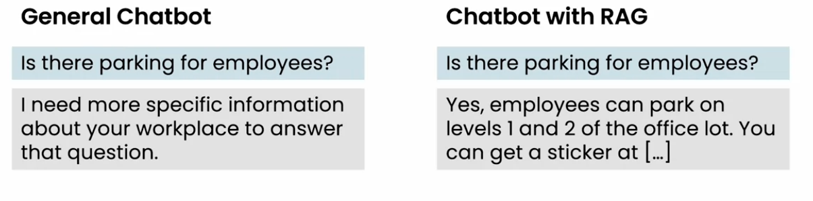
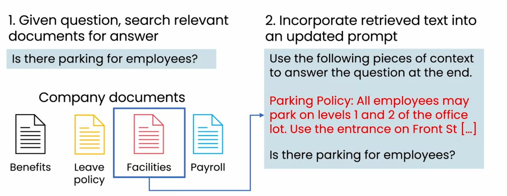
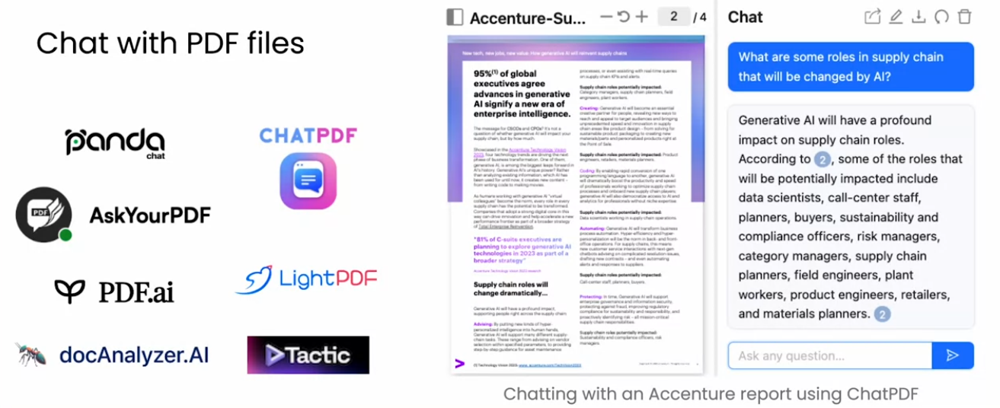
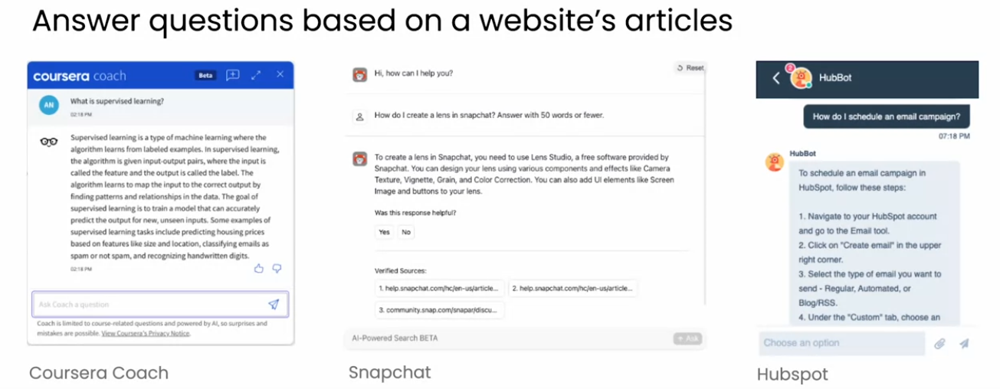
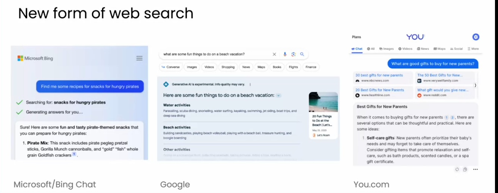
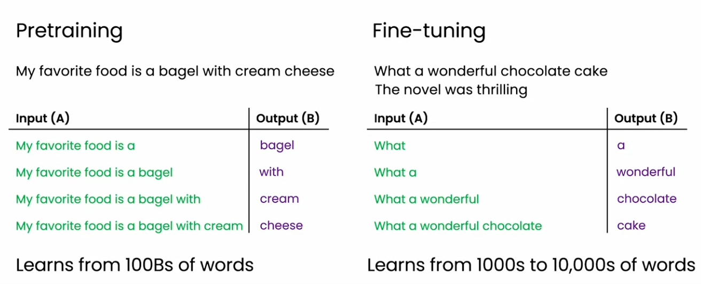
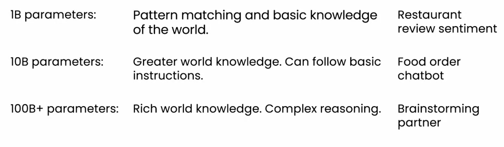
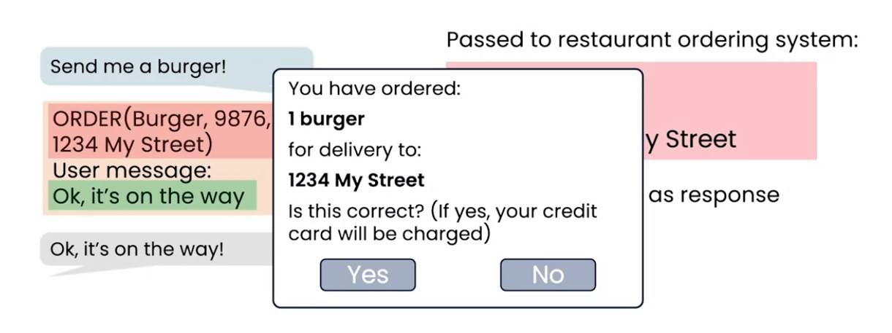
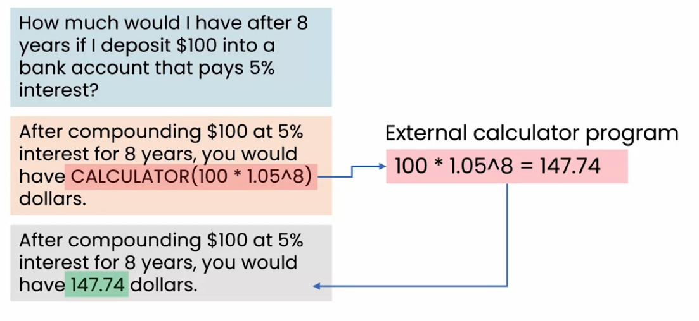
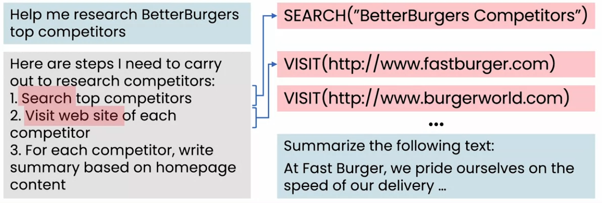

# Advanced Technologies: beyond prompting

### Retrival augumented Generation (RAG)
#### Example:



- General chatbot may not be able to answer the company policy based questions as it does not know about it.
- Chatbot with RAG, may able to answer the company specific question/answer if context provided.



- To provide a context to chat with RAG, person can choose text from the relevant document and paste it to chatbot prompt.
- There is a limitation of text input can be provided to any LLM, that is why providing only relevant text is helpful in this case.
- After provided the context, LLM maybe able to answer to the question now or even able to provide the document reference that where this answer came from.

### Example of RAG applications



- There are some websites which provides options to upload PDF files and to ask question on it.
- Those websites have different performances.



- Some chatbots like coursera, snapchat, hubspot etc. read articles and answer questions on the same.



- RAG is also using for web search engines.
- Those web search engines are degined like a chatbot where we can ask questions.

### Big idea: LLM as a reasoning engine
- Think LLM like a reason engine instead of source of information
- LLM can take the relevant text as prompt, process it and answer questions.

## Fine-tuning

- Fine-tuning is very useful when it is difficult to write a prompt to have correct response

### Pretraining and fine-tuning



- Pretraining is doen using supervised learning technique.
- Here, fine-tuning is targeted to have positive response from the LLM

### Examples of fine-tuning
- Write a customer call (call center) summary to specific style to have required details on it.
- Mimicking writing or speaking style (required fine-tuning of the model)
    - Sound like some person (as text response)
    - Or sound like a cartoon characters

- Fine-tuning LLM for medical notes reading
    - Fine-tuning can be helpful for fine-tuning below medical notes
    ```
    Pt c/o SOB, DOE. PE: RRR, JVD absent, CTAB.
    EKG: NSR. Tx: F/u w/ pcp, STAT CXR, cont. PRN 02.
    ```

    - With some relevant examples, LLM can be fine tune to read medical notes

- Fine-tune to read financial documents
    - If there is a legal document, it is easier for lawyer to understand it, but for normal person it can be difficult to understand.
    - LLM fine-tuned in tis case to understand such documents

- Fine-tune to specific task to get small model
    - Large models like 100B+ parameters takes very high time to deploy and higher cost to run them
    - Small models can be executed in a laptop or on mobile (edge device) to perform a specific tasks
    - Ex: to analyze restaurant review for 'positive'/'negative' comments parameter
    - Such models can be trained using 500 or 1000 or 10000 examples.

## Pretraining an LLM
- Pretraining LLM for general purpose required a lot of resources and money.

### When should you pretrain the LLM
- Many team are pretraining general purpose LLM from learning from internet.
- This take many months, $10s of millions of amount and huge amount of data.

#### For building an specific application
- Building own LLM should be a last resort
- Building own LLM can help if we have highly specified domain.
- EX: bloombergGPT build for finance and specific purpose to the model is to answer financial queries.

## Choosing a model 



- 1B model is suitable for a specific task like restaurant review.
- 10B parameter model is suitable for chatbot which having a specific purpose.
- 100B+ parameter model is best suitable when a brainstorming needed to refine an idea. Such models have most of the general purpose information to brainstorm the idea

### Choose between closed and open source
#### closed source model
- Easy to use as provider provides an easy API to call it.
- More large/powerful models as the models are already trained before with huge data.
- Relatively inexpensive to use them.
- Risk of vendor lock-in with these model and switching between models having some cost. It may also require to change prompt to have same result as previous vendor.

#### open source model
- Full control over model
- Can run on your own device (on-prem, PC etc.)
- Full control over data privacy (ex medical data)


## How LLMs follow instructions: instructions tuning and RLHF 

- LLMs predict next word which generates the response of the prompt.

### How do chat systems learn to follow instructions

- LLM predict next word by pretraining using supervised learning.
- But sometimes, it could predict wrong response (next word) whe a question been asked
- This could be possible due to LLM read it from internet from a Article.
- In these cases, LLM fine tuning is required to have correct response.

### Reinforcement learning from Human feedback(RLHF)
- helpful, Honest, harmless

- Step 1: Train an answer quality reward (reward) model
    - Rate the good answers
- Step 2: Have LLM generate a lot of answers. Further train it generate more responses that get higher scores

## Tool use for food order taking



- A food order chatbot can order a burger if proper instructions provided.
- on safer side, a prompt to confirm the order, has to be there to avoid having any mistake from chatbot.

### Tools for reasoning



- Tools can be attached with LLM to increase LLMs capability.
- We have to sure here that the LLM calls a right tool otherwise it could cause a damage (maybe irreversible damage)

### Agents
- Use LLM to carry out carry out complex sequence of actions
- This is a cutting edge area of research



- we can provide instruction to the LLM to follow steps to have answers
- This is still in a early stage to have steps to find complicated answers of a question (prompt)


