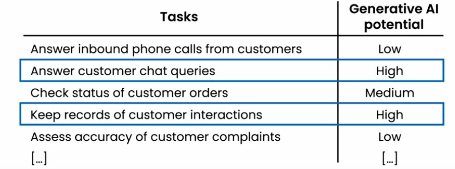
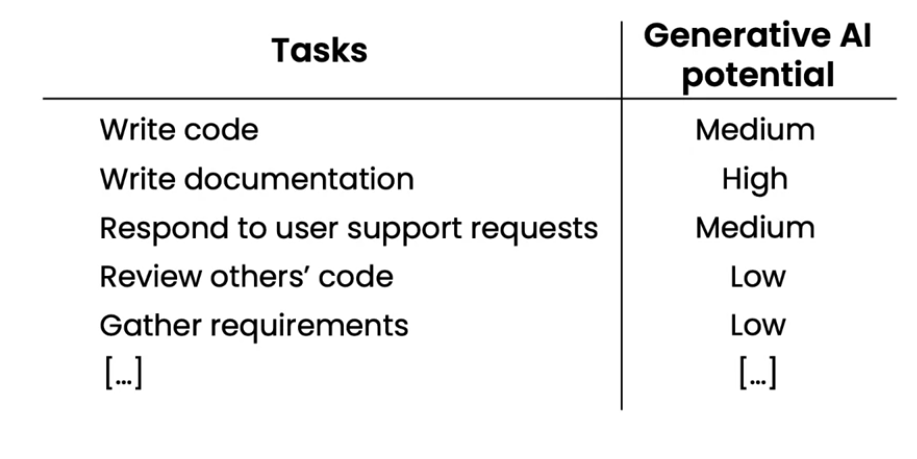
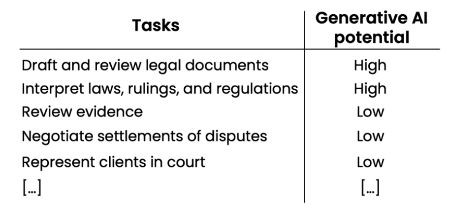
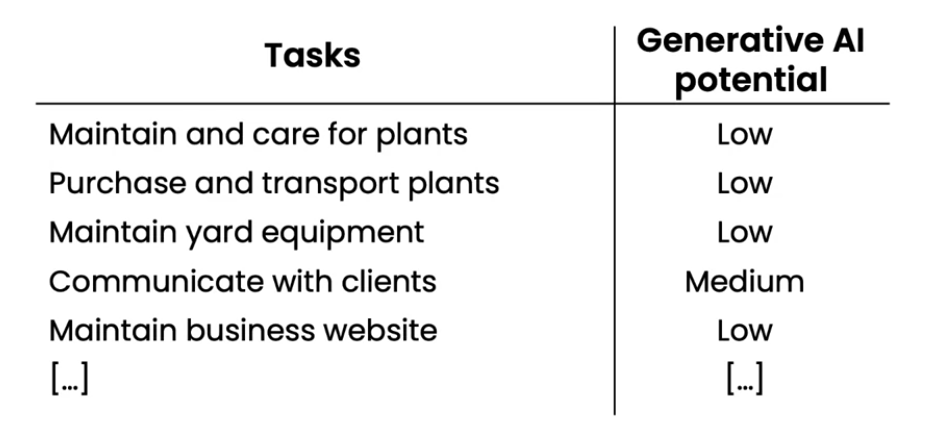
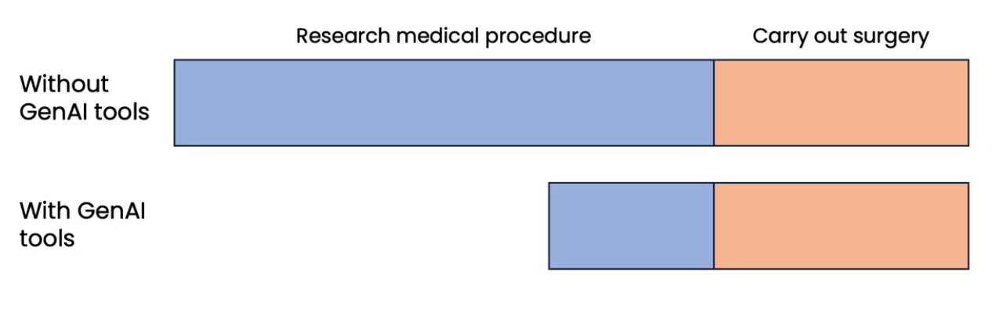
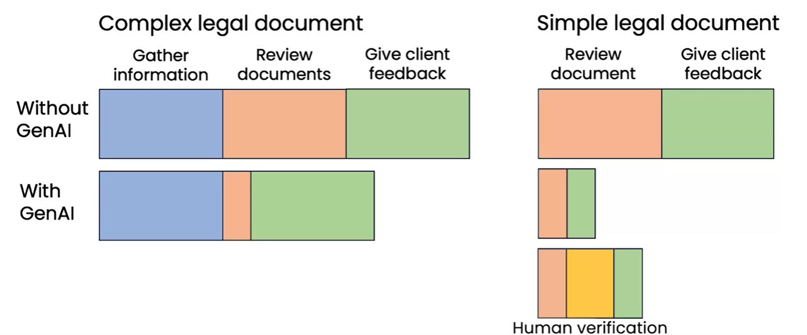
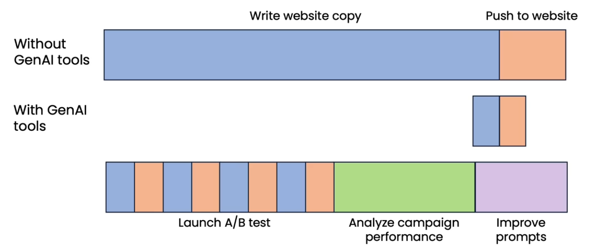

# Generative AI and business

## day-to-day usage of web UI LLMs

### Writing Assistant

- LLMs are very good at rewriting a phrase to make it better, help on email writing to find correct points, summarizing text or for programmer, writing a program of some task.

## Task analysis of jobs

### Identifying automation opportunity  

- In a call center, there are many tasks can be automated.
- Based on tasks, there automation with generative AI potential can be derived.
- These tasks maybe deffer from company to company

### Augmentation VS. automation

#### Augmentation
- Help human with task
- AI generates the response but human send it after confirmation
- Human response become faster in this case

#### Automation
- Automatically perform a task
- Automatically reply to the customer for a response

##### Business may start with augmentation model and gradually move to automation

### Evaluating AI potential

- Potential for augmenting or automating task depending on:
    - Technical feasibility
    - Business value

#### Technical feasibility
- If with some instruction, tasks can be automated
- If not sure, check in LLM with a prompt if task is feasible
- An AI engineer can help to access if RAG, fine-tuning or other technique can help to automate the task

#### Business feasibility
- How much time will be spend on this task
- Is automating the task will have value addition

## Additional job analysis examples

### Computer programmer

- Computer programmer may have different tasks.
- Based on Generative AI potential, they can be automated

### Lawyer

- Some documentation and interpretation tasks can be automated using generative AI but others are difficult to automate yet.

### Landscaper

- Landscaper tasks are difficult for generative AI. Most of them cannot be automated.

## New workflow and new opportunity

- New workflow design with Generative AI could reduce the time for work done

### Examples
1. Surgeon

- Without gen AI, surgeon could spend a lots of time on research
- With gen AI, surgeon can directly ask questions instead of searching, which could helpful for reducing the time

2. Legal documentation review

- With Gen AI, it could take lesser time to review the complex documents
- If a simple document like NDA needs to be shared to the customer, Gen AI can be helpful for review document and client feedback meeting.
- If Gen AI document review is not fully trust worthy, a human verification step can be added to verify document before to have client's feedback

3. Marketing automation

- Gen AI can reduce the write website copy tasks and push to website for customers
- With this time saving, multiple version of write websites copy can be published. This can help to Analyze campaign performance (which version is performing better than others) and improve prompt accordingly

### Analyzing customer's tasks

#### Example: helping customers to build a website

- A website could have multiple tasks to complete to build it
- Generative AI can make those task easy to build.

## Teams to build generative AI softwares

- If a team with software engineer learns LLMs and prompting, even just basics of it, they becomes very efficient in building softwares

### Some common roles

#### Software Engineer
- Writing software applications
- Ideally have basic knowledge of LLMs/prompting

#### Machine learning engineer
- Responsible for implementing AI systems
- Familiar with LLM, prompting, RAG, fine-tuning

#### Product manager
- Identifying the scope of the project. Here machine learning/ AI project

#### Prompt engineer
- Just writing prompt for LLM
- Not a dedicated role

### Getting started with a small team
- One person team
    - Just a software engineer who knows prompting
    - Just a machine learning engineer
    - Or just a manager

- Two person team
    - Can be machine learning engineer + software engineer
    - But other configurations also works well

- Large team
    - Data engineer, data science, Project manager, Machine learning researcher

### Automation potential across sectors

